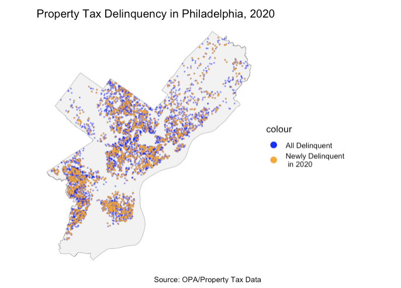
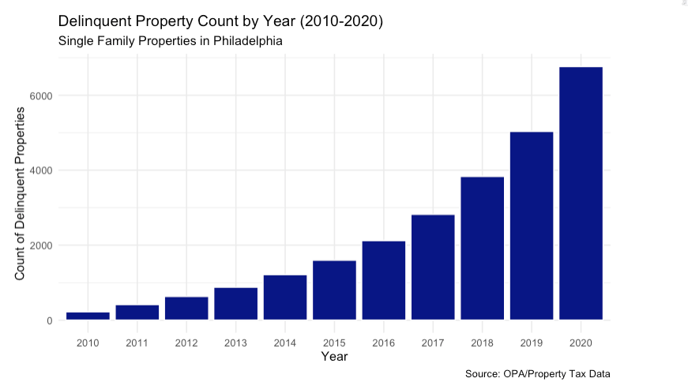
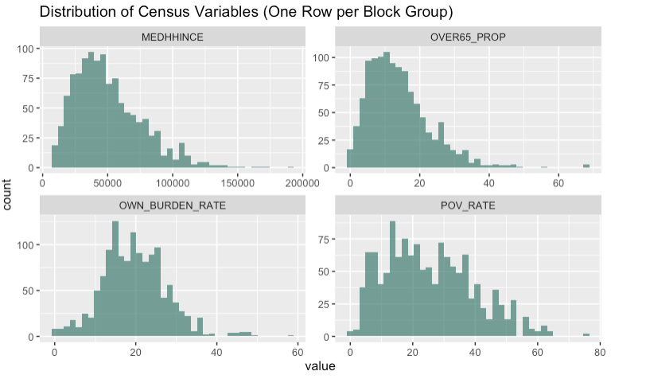
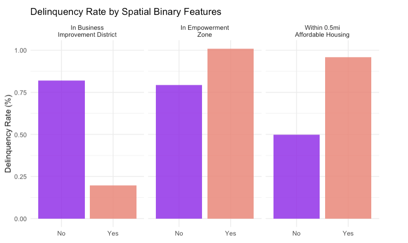
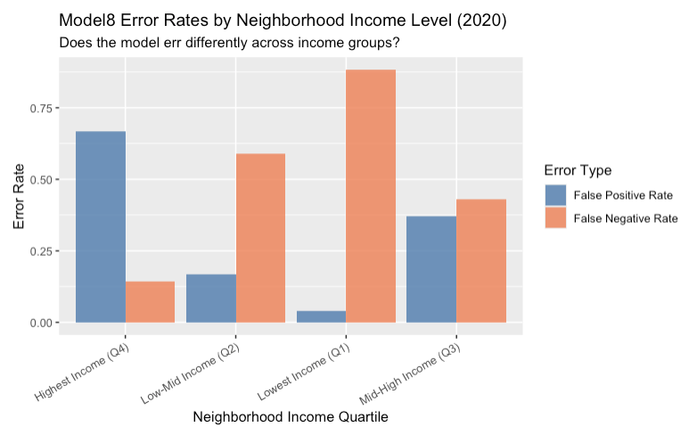

```{r}
#|echo: false
#|eval: false
library(knitr)
```

## The Problem {background-color="#F5F0E8"}

-   Adequately collecting property taxes has been a big issue for the City of Philadelphia

-   Property tax delinquency directly affects city revenue

    -   55% goes to the School District of Philadelphia
    -   45% goes to the City of Philadelphia General Fund

------------------------------------------------------------------------

## Tax Delinquency in Philadelphia {background-color="#F5F0E8"}

-   As of fiscal year 2024, the city was owed nearly \$197 million\
    across more than 54,000 parcels (including residential and commercial)

------------------------------------------------------------------------

## Equity Considerations {background-color="#F5F0E8"}

Groups that are known to be disproportionately impacted:

-   Low-income Households
-   Elderly
-   Disabled
-   Residents in gentrifying areas

------------------------------------------------------------------------

## High Repercussions {background-color="#F5F0E8"}

Tax delinquency debt can accumulate rapidly with added interest

**\~1.4%** - property tax rate of assessed market value

**1.5%** - monthly interest

**15%** - penalty applied for delinquency status

------------------------------------------------------------------------

## Goal {background-color="#F5F0E8"}

To identify which properties may need early outreach before entering tax delinquent status

-   Payment plans

-   Housing counseling

-   Location-based Information Dissemination

------------------------------------------------------------------------

## Research Question {background-color="#F5F0E8"}

Which properties, not delinquent in 2019, will become delinquent in 2020?

-   2020 being a significant year given that the economy was impacted by COVID-19 pandemic.

-   Predicting delinquency for non-delinquent properties in 2019 controls for properties that were already struggling, which helps to isolate the effect of start of the pandemic in 2020

------------------------------------------------------------------------

## Significance {background-color="#F5F0E8"}

-   By identifying the homes which were at risk of delinquency during periods of economic instability, the model may be useful to the City of Philadelphia as a reference tool.
-   Provides an overview of the properties and, in turn, areas that may be most at risk during future times of economic hardship.

**As mentioned earlier...**

-   Delinquency disrupts city services and neighborhood stability
-   Early identification allows targeted intervention before debt accumulates
-   Enables the City to be less reactive and more proactive when addressing tax delinquency

------------------------------------------------------------------------

## Data Sources {background-color="#F5F0E8"}

| Source | Outcomes Created for Model |
|----|----|
| City of Philadelphia Real Estate Tax Delinquency | Delinquency outcome (2010 to 2020) |
| OPA Property Characteristics | Market value, livable area, year built |
| ACS 2019 (Block Group) | Income, owner rate, age 65+, poverty |
| ACS 2019 (Census Tract) | Unemployment, owner cost burden |
| OpenDataPhilly | BIDs, empowerment zones, HCA distance |
| Philadelphia Crime Data | Burglary hotspot distance |

------------------------------------------------------------------------

## Final Model predictors {background-color="#F5F0E8"}

**lag_delinquent** → Whether the property was delinquent last year\
**times_delinquent_before** → Number of past delinquency years\
**log_marketvalue** → Property value (logged)\
**year_built** → Age of the property\
**log_medhhince** → Median household income (logged)\
**own_burden_rate** → Share of owners spending a high % of income on housing\
**log_over65** → % of population over 65 (logged)\
**log_pov_rate** → Poverty rate (logged)\
**in_bid** → Located in a Business Improvement District\
**log_disthca** → Distance to housing counseling services (logged)\
**log_disthotcrime** → Distance to burglary hotspots (logged)\
**in_emp** → Located in an Empowerment Zone\
**in_aff_buf** → Near affordable housing\
**Name** → Neighborhood fixed effect

------------------------------------------------------------------------

## Methods: Logistic Regression {background-color="#F5F0E8"}

**Our outcome variable is binary** where delinquent is 1 or not delinquent is 0

**Our approach:**

-   Panel dataset: 2010–2020, one row per property per year
-   Train on 2010–2019
-   Test on 2020
-   Only test on properties **not delinquent in 2019** (lag_delinquent == 0)

|     |
|:----|
|     |

## Challenge: Class Imbalance {background-color="#F5F0E8"}

**Less than 1% of properties become newly delinquent in any given year**

A model that predicts "not delinquent" for everyone gets 99% accuracy, which assume all properties are delinquent when some may not be.

**Iterative Modelling Process:**

+---------+-------------------------------------------------------------------------------------------------------------------------------------------------------------------------------------------------------------+
| Model   | Approach                                                                                                                                                                                                    |
+=========+=============================================================================================================================================================================================================+
| Model 1 | **Lag only using**                                                                                                                                                                                          |
|         |                                                                                                                                                                                                             |
|         | lag_delinquent + times_delinquent_before                                                                                                                                                                    |
+---------+-------------------------------------------------------------------------------------------------------------------------------------------------------------------------------------------------------------+
| Model 2 | **+ Property Characterisitcs:**                                                                                                                                                                             |
|         |                                                                                                                                                                                                             |
|         | lag_delinquent + times_delinquent_before + log_marketvalue + year_built                                                                                                                                     |
+---------+-------------------------------------------------------------------------------------------------------------------------------------------------------------------------------------------------------------+
| Model 3 | **+Census Data**                                                                                                                                                                                            |
|         |                                                                                                                                                                                                             |
|         | lag_delinquent + times_delinquent_before + log_marketvalue + year_built + log_medhhince + OWN_BURDEN_RATE + log_over65 + log_pov_rate                                                                       |
+---------+-------------------------------------------------------------------------------------------------------------------------------------------------------------------------------------------------------------+
| Model 4 | **+Spatial Features**                                                                                                                                                                                       |
|         |                                                                                                                                                                                                             |
|         | lag_delinquent + times_delinquent_before + log_marketvalue + year_built + log_medhhince + OWN_BURDEN_RATE + log_over65 + log_pov_rate + in_bid + log_disthca + log_disthotcrime + in_emp + in_aff_buf,      |
+---------+-------------------------------------------------------------------------------------------------------------------------------------------------------------------------------------------------------------+
| Model 5 | **+ Neighborhood Fixed Effect**                                                                                                                                                                             |
|         |                                                                                                                                                                                                             |
|         | lag_delinquent + times_delinquent_before + log_marketvalue + year_built + log_medhhince + OWN_BURDEN_RATE + log_over65 + log_pov_rate + in_bid + log_disthca + log_disthotcrime + in_emp + in_aff_buf+ Name |
+---------+-------------------------------------------------------------------------------------------------------------------------------------------------------------------------------------------------------------+
| Model 7 | **+ Inverse class weights**                                                                                                                                                                                 |
|         |                                                                                                                                                                                                             |
|         | same as model 5 with class-weights                                                                                                                                                                          |
+---------+-------------------------------------------------------------------------------------------------------------------------------------------------------------------------------------------------------------+
| Model 8 | **+ Balancing sample (4:1) + weights (*Final Model)***                                                                                                                                                      |
|         |                                                                                                                                                                                                             |
|         | same as model 5 with balanced sample and class-weights                                                                                                                                                      |
+---------+-------------------------------------------------------------------------------------------------------------------------------------------------------------------------------------------------------------+

------------------------------------------------------------------------

## EDA: Where is Delinquency? {background-color="#F5F0E8"}

```{r}

```

------------------------------------------------------------------------

```{r}

```

------------------------------------------------------------------------

```{r}

```

------------------------------------------------------------------------

```{r}

```

------------------------------------------------------------------------

## Model 8: Results {background-color="#F5F0E8"}

**Undersampling + Class Weights + Neighborhood Fixed Effects**

| Metric      | Value | What it means                                          |
|-------------|-------|--------------------------------------------------------|
| Sensitivity | 0.797 | Caught \~80% of properties that became delinquent      |
| Specificity | 0.493 | Correctly categorized 49% of non-delinquent properties |
| Precision   | 0.011 | 1.1% of flagged properties were truly delinquent       |
| AUC         | 0.706 | considered acceptable model performance                |

------------------------------------------------------------------------

## Model 8: Equity Analysis {background-color="#F5F0E8"}

```{r}

```

The model performs slightly better in **mid-high income neighborhoods**

------------------------------------------------------------------------

## Limitations {background-color="#F5F0E8"}

-   Spatial Autocorrelation detected in residuals

    -   Machine did not have capacity to run geographically weighted logistic model

-   Limited data sources

    -   Only able to use data that was openly available

-   Class imbalance

    -   High sensitivity achieved at cost of low precision, resulting in many false positives.

------------------------------------------------------------------------

## Recommendations {background-color="#F5F0E8"}

**How the City should use this model:**

1.  **Neighborhood Thresholds**: could help if the City considers lower thresholds in high-delinquency areas and higher in low-risk areas

2.  **Monitor Equity Impacts**: Track if outreach efforts disproportionately burden any income group or neighborhood, then revisit thresholds if disparities do emerge

------------------------------------------------------------------------

## Thank You! {background-color="#F5F0E8"}

Jenny \| Maude \| Shubhanga \| Vedika \<3

Predicting Philadelphia Property Tax Delinquency \| CPLN 5920 \| April 28, 2026

------------------------------------------------------------------------

# Sources {background-color="#F5F0E8"}

City of Philadelphia Department of Revenue. (n.d.). *Real estate tax delinquencies* \[Data visualization\]. City of Philadelphia Open Data. <https://data.phila.gov/visualizations/real-estate-tax-delinquencies>

Fofana-Bility, F. (2025, June 12). *Eight questions answered about Philly property taxes*. City of Philadelphia Department of Revenue. <https://www.phila.gov/2025-06-12-eight-questions-answered-about-philly-property-taxes/>

Economy League of Greater Philadelphia. (2024). *The ebb and flow of realty transfer tax revenue in Philadelphia, 2010–2024*. <https://www.economyleague.org/resources/ebb-and-flow-realty-transfer-tax-revenue-philadelphia-2010-2024>

Moselle, A. (2022, September 8). *Philadelphia's property tax revenue grew faster than peers -but it still lags*. The Philadelphia Inquirer. <https://www.inquirer.com/news/philadelphia/philadelphia-property-taxes-assessment-pew-20220908.html>

Yadav, D. (2020, April 14). Weighted logistic regression for imbalanced dataset. Medium. <https://medium.com/data-science/weighted-logistic-regression-for-imbalanced-dataset-9a5cd88e68b>

GeeksforGeeks. (2024, March 11). Weighted logistic regression for imbalanced dataset. <https://www.geeksforgeeks.org/machine-learning/weighted-logistic-regression-for-imbalanced-dataset/>
