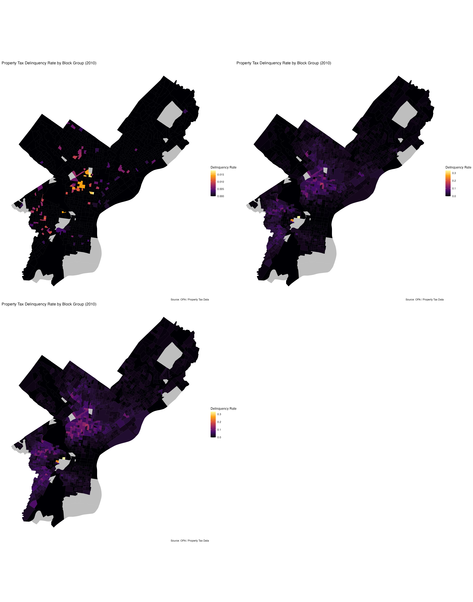

```{r library load}
#| message: false
#| warning: false
#| echo: false

library(tidyverse)
library(lubridate)
library(sf)
library(tigris)
library(tidycensus)
library(viridis)
library(knitr)
library(kableExtra)
library(patchwork)
library(modelsummary)
library(scales)
library(here)
library(janitor)
library(spdep)
library(pROC)
library(caret)

options(scipen = 999)
options(tigris_use_cache = TRUE)
set.seed(0510)
```

# Executive Summary

This report develops a predictive framework to identify Philadelphia properties that are at risk of becoming property tax delinquent before delinquency actually occurs, particularly during periods of economic hardship like COVID-19. Property tax delinquency in Philadelphia increased from approximately \$165 million to \$178.5 million between 2024 and 2025, creating challenges for both municipal services and the School District of Philadelphia which relies heavily on property tax revenue. 

To better understand which properties are most vulnerable to delinquency, we created a longitudinal dataset of single-family properties in Philadelphia from 2010 to 2020. The goal of this project was not to create a tool for enforcement, but instead to provide the city with a way to identify financially vulnerable households earlier so that outreach and assistance can happen before penalties and debt begin to accumulate.  

The project combined multiple sources of data, including property tax delinquency records, census data, crime data, and neighborhood level spatial features. We used variables such as poverty rate, SNAP participation, housing burden, educational attainment, unemployment, proximity to affordable housing, distance to housing counseling agencies, and whether properties were located within Business Improvement Districts or Empowerment Zones. Spatial joins and feature engineering techniques were used to connect property-level observations with broader neighborhood conditions across Philadelphia.  

Several logistic regression models were tested throughout the analysis. One of the biggest challenges was the severe class imbalance in the dataset, since fewer than 1% of properties became delinquent. To better account for temporal patterns, the model incorporated yearly census data and used a validation framework where models were first trained on 2010-2018 data and validated on 2019 data before being retrained on 2010-2019 data and tested on 2020 outcomes. After testing multiple approaches, Model 8 produced the strongest results by combining sample rebalancing and inverse class weighting. The model achieved a sensitivity score of 84.2%, correctly identifying 3,430 properties that later became delinquent in 2020 while missing only 225.

The exploratory analysis also revealed clear spatial and socioeconomic patterns. Delinquency increased significantly between 2010 and 2020 and remaining concentrated in areas facing greater economic hardship. Properties located within Business Improvement Districts were generally less likely to become delinquent, while properties located near affordable housing developments inside Empowerment Zones were more likely to experience delinquency.  

While the model performed strongly in terms of sensitivity, it also produced a relatively high number of false positives, meaning that many properties flagged as at-risk did not actually become delinquent. In addition, the model performed less effectively in some of Philadelphia’s lowest income neighborhoods, which highlights the broader structural inequalities tied to property tax delinquency. 

Even with these limitations, the model still provides meaningful policy value. Rather than being used for punitive enforcmenet, the model is best suited for low cost interventions such as mailed outreach about payment plans, hardship exemptions, and housing counseling programs. Overall this project demonstrates how predictive modeling can help the City of Philadelphia take a more proactive and equitable approach to address property tax delinquency while still recognizing the need for broader long-term support in economically vulnerable communities.  

# Introduction

Between 2024 and 2025, the amount of property tax delinquency in Philadelphia increased from \$165M to \$178.5M (City of Philadelphia Department of Revenue, 2025, 2026). Given that 55% of property tax revenue is directed towards the School District of Philadelphia, with the remaining 45% going to general municipal services, the City must find ways to minimize non-delinquent properties from becoming delinquent to better focus on existing delinquent properties. Additionally, once properties become delinquent, they face the risk of remaining delinquent by accumulating 1.50% monthly interest on the amount owing, in addition to a 15% penalty. Both of these added costs sit on top of the nearly 1.40% property tax on the total market value. 

While property tax delinquency is an issue faced by many disadvantaged individuals, such as lower-income homeowners, older adults on fixed incomes, among many others, COVID-19 was an unprecedented example of tax relief policies implemented to minimize impacts on residents. In Philadelphia, numerous tools were implemented, such as extending deadlines, suspending sheriff sales, halting reassessments, removing early payment discounts, and providing some targeted interventions for homeowners and older adults, to name a few. Given that COVID-19 was an unprecedented time, these policies were reactive. However, the economic impacts must also be considered as reduced tax collection results in less operating budget. For example, the 2021 budget saw a \$450M budget deficit (WHYY). When it comes to property taxes in Philadelphia, this means adverse implications for the School District, as well as budgets for municipal services such as public safety and street maintenance. Evidently, there is a need to identify properties at risk of delinquency before delinquency occurs, regularly and during major events like COVID-19, that would consider household hardship and unnecessary revenue loss.

Thus, the aim of this report is to use a logistic regression model to identify properties that were not previously delinquent in 2019 but were at risk of delinquency in 2020. While the model is evaluated using the transition from 2019 to 2020, its broader purpose is to demonstrate a framework for identifying properties at elevated risk before delinquency occurs, including during periods of economic disruption. However, this tool is not intended to make enforcement decisions or replace broader housing assistance policies. Rather, its value lies in supporting early, low-cost outreach efforts that may help households avoid deeper financial distress while allowing the City to better prioritize limited resources. We also recognize that tax delinquency does not occur equally across all neighborhoods, as lower-income communities may face deeper structural barriers that require more sustained support beyond predictive targeting in isolation.

# Methods

## Data Cleaning

Prior to conducting any analysis, each data set was downloaded, regardless of if they were used in our final model. Data cleaning and preparation from each data source was required. 

Using each year’s American Community Survey 5-year estimates from 2010 to 2020, were retrieved at the block group and the census tract level for variables that were not available at the block group level for Philadelphia County using tidycensus R package. Considering block group level data is quite granular, it was selected as the geography used to display data in choropleth maps, as displayed below. This allowed for more precise visualizations of neighborhood characteristics and variation across Philadelphia in our EDA. 

One of the earliest steps we took in cleaning and preparing data was geocoding all the addresses for properties so that we could plot the points. The code was produced by Claude; however, because the file size was too large, it was omitted from this report.  From there, the general processes including downloading the datasets to local machines, then loaded into RStudio to begin the cleaning process.  

To indicate the reliability of the variables, the percent of margin of error was calculated for each variable by dividing the margin of error for a variable with its corresponding estimate and multiplying by 100. Block groups were labelled “Unreliable” or “Use with Caution” using 40% as the threshold, where MOE greater than 40% were considered “Use with Caution”. With that said, rather than removing all “Unreliable” block groups, which would substantially reduce available observations, these MOE were saved in a separate table and used for reference. By preserving all variables, doing so, the observations were able to be carried into further parts of the analysis, this included calculated absolute numbers as percents by dividing the total respective universes. For example, share of bachelor degrees or higher, those living below the poverty line, and share of the population that is white was divided by the total population, where as vacancy share was divided by total housing units. This allowed for more meaningful comparisons across block groups.  

 We selected the variables we wanted to include from the delinquent and OPA data sets- we did not need the structural features may influence home sales price, but this is not what. For all spatial features, we selected the columns required for future engineering, for example, for Business improvements districts, we opted to the GEOID and BID names. A similar process followed for other spatial features. GEOID were retained for joining purposes in later code. Some variables underwent spatial engineering the same code as data cleaning, such gas HCA buffers. More robust feature engineering was done later. Additionally, to ensure a more seamless process when engineering features, all datasets were converted to Coordinate Reference System 2272. Finally, all NA values were removed to ensure only observations with data are used in the final model. 

We must note this was an iterative and cyclical process where we often jumped between modeling and Data cleaning as we continued to unearth new issues in our data. What is presented here is a summary of the steps taken, though it was a much more rigorous and time-consuming process- more than what can be described in words. For that reason, what is presented is a simplified summary.

### Set-up: Loading and Cleaning Key Datasets

### Property and Housing Data

```{r clean housing data}
#| message: false
#| warning: false
#| echo: true

## Clean, filter, and prepare OPA and property tax data for spatial analysis across Philadelphia single-family homes.


# Clean and filter property tax data to keep delinquent house records from 2010–2020, REMOVING is_actionable = false, Removing unnecessary variables
prop_tax <- read.csv(here("data/geocoded_output.csv")) %>%
  select(-c(
    unit_type, unit_num, agreement_agency, years_in_bankruptcy,
    most_recent_bankrupt_year, oldest_bankrupt_year, principal_sum_bankrupt_years,
    owner, co_owner, zip_4, mailing_address, return_mail,
    coll_agency_num_years, coll_agency_most_recent_year, coll_agency_oldest_year,
    coll_agency_principal_owed, coll_agency_total_owed, total_amount_bankrupt_years,
    mailing_zip, the_geom, the_geom_webmercator, cartodb_id, objectid,
    most_recent_payment_date, total_assessment, building_code,
    detail_building_description, sequestration_enforcement, bankruptcy
  )) %>%
  filter(opa_number != 0,
         oldest_year_owed >= 2010, oldest_year_owed <= 2020,
         general_building_description == "house",
         is_actionable == TRUE) %>%
  mutate(delinquent = 1)

#bringing final opa property data
opa_prop <- read.csv(here("data/opa_properties_for_FINAL.csv"))

# Filter OPA data to keep valid single-family home sales with usable price, area, year built, and location values. 

house <- opa_prop %>%
  filter(category_code_description == "SINGLE FAMILY",
         !is.na(total_livable_area), !is.na(sale_price),
         !is.na(year_built), !is.na(location),
         sale_price >= 20000, sale_price <= 1000000,
         total_livable_area > 0) %>%
  mutate(across(where(is.character), ~ na_if(., ""))) %>%
  filter(year_built > 0)

## Preparing OPA dataframe for spatial analysis

# OPA uses WKT geometry with a SRID prefix -- strip it before parsing
opa_prop_clean <- opa_prop %>%
  filter(!is.na(shape), shape != "") %>%
  mutate(shape_clean = gsub("^SRID=2272;\\s*", "", shape))

# Getting data for Philadelphia boundary for spatial analysis
PHL_LIMITS <- st_read(here("data/City_Limits.shp")) %>% st_transform(2272)
phil_hood  <- st_read(here("data/philadelphia-neighborhoods.shp")) %>%
  select(LISTNAME, geometry) %>% rename(Name = LISTNAME) %>% st_transform(2272)

# Convert cleaned OPA property data to a spatial object and match it to the Philadelphia boundary CRS.
opa_sf <- st_as_sf(opa_prop_clean, wkt = "shape_clean", crs = 2272) %>%
  st_transform(st_crs(PHL_LIMITS))
```

### Creating Property Panel Data

```{r creating propertyear panel data}
#| message: false
#| warning: false
#| echo: true

# Create a property-year panel for 2010–2020 and add delinquency history variables based on whether each property was delinquent in the past.

# Expand delinquent records into one row per year of delinquency
prop_tax_expanded <- prop_tax %>%
  rowwise() %>%
  mutate(year = list(oldest_year_owed:most_recent_year_owed)) %>%
  unnest(year) %>%
  mutate(delinquent = 1) %>%
  select(opa_number, year, delinquent)

# Joining clean delinquent property tax records with cleaned, expanded opa properties dataframe 
panel <- expand_grid(house, year = 2010:2020) %>%
  rename(opa_number = parcel_number) %>%
  left_join(prop_tax_expanded, by = c("opa_number", "year")) %>%
  # mark all NA cells as 0 for 'delinquent' column variable 
  mutate(delinquent = ifelse(is.na(delinquent), 0, 1))

# Engineering Lag features: was this property delinquent last year? How many times before?
panel <- panel %>%
  arrange(opa_number, year) %>%
  group_by(opa_number) %>%
  mutate(
    lag_delinquent          = lag(delinquent, default = 0),
    times_delinquent_before = cumsum(lag_delinquent)
  ) %>%
  ungroup()

```

### Census Data

We utilized ACS data to calibrate socioeconomic factors into our predictive model for tax delinquency in Philadelphia. The ACS variables at the block group level include GEOID, name, year, median household income, White proportion, owner rate, renter rate, vacancy rate, and over-65 proportion. These were selected for specific reasons. GEOID is used as the joining factor to connect ACS data to Philadelphia’s spatial divisions. Name refers to the assigned block group, whereas year identifies the specific years between 2010 and 2020, which are later used for temporal analysis. 

Variable-wise, median household income is an essential consideration in this analysis, primarily because of the direct correlation between income, or financial capacity, and household tax payments. The owner-occupied rate is determined by the number of homes occupied by owners per block group because ownership may affect delinquency probability, where homeownership may indicate neighborhood-level stability. Owner-occupied units in Philadelphia are eligible for the Owner-Occupied Payment Agreement (OOPA), which allows homeowners to pay past-due taxes in affordable monthly amounts. These benefits may prevent tax delinquency for these households and can become an essential predictor for this model (City of Philadelphia, n.d.). While we do include renter rate here, it may not be utilized in the model later, as it would reflect the same analysis as the owner-occupied rate. 

The proportion of White individuals may help determine the racial diversity of specific areas, where historically disadvantaged individuals, those who are not White, may face higher financial hardship than others. Looking into this thus becomes essential in the context of this model. In terms of those 65 years and older, we understand that they may face hardships and may owe taxes that they cannot afford (Law for Seniors, 2024). Additionally, seniors may be more likely to have paid off their mortgage and, therefore, more likely to owe their own property taxes, increasing the likelihood of delinquency (Bankrate, 2025). 

The vacancy rate for localities may also be as essential as local economic conditions. Tax-delinquent properties are more likely to be vacant (Center for Community Progress, 2022), and thus vacancy rate may become an essential indicator or predictor for the model. 

Moving forward with the other forms of ACS data utilized, we used some census tract-level data. These variables were not available at the more granular block group level, but they were essential nonetheless and were therefore included at the tract level. These variables will then be spatially joined to the block group level later. They include unemployment rate, bachelor’s+ rate, poverty rate, owner burden rate, renter burden rate, combined burden rate, and SNAP rate. All of these are economic indicators that are essential to include in this analysis of tax delinquency.

### Census Block Group-Level

```{r census api key}
#| echo: false

census_api_key("c61294d533815353a666f356be78c2a75d0b1f00", install = FALSE)
```

```{r}
#| message: false
#| warning: false
#| echo: true

years <- 2013:2020

bg_raw <- map_dfr(years, function(yr) {
  get_acs(
    geography = "block group",
    state = "PA",
    county = "Philadelphia",
    variables = c(
      MEDHHINC = "B19013_001",
      WHITE = "B03002_003",
      TOTAL_OCC = "B25003_001",
      OWNER_OCC = "B25003_002",
      RENTER_OCC = "B25003_003",
      TOTAL_HSG = "B25001_001",
      VACANT = "B25004_001",
      OWN_TOT = "B25038_002",
      RNT_TOT = "B25038_009",
      BUILT_TOT = "B25034_001",
      TPOP = "B01003_001",
      M_6566 = "B01001_020",
      M_6769 = "B01001_021",
      M_7074 = "B01001_022",
      M_7579 = "B01001_023",
      M_8084 = "B01001_024",
      M_85P = "B01001_025",
      F_6566 = "B01001_044",
      F_6769 = "B01001_045",
      F_7074 = "B01001_046",
      F_7579 = "B01001_047",
      F_8084 = "B01001_048",
      F_85P = "B01001_049"
    ),
    year = yr,
    survey = "acs5",
    output = "wide"
  ) %>%
    mutate(year = yr)
})

# backfill 2010-2012 with 2013 data (earliest available)
bg_early_years <- bind_rows(
  bg_raw %>% filter(year == 2013) %>% mutate(year = 2010),
  bg_raw %>% filter(year == 2013) %>% mutate(year = 2011),
  bg_raw %>% filter(year == 2013) %>% mutate(year = 2012)
)

bg_raw <- bind_rows(bg_early_years, bg_raw) %>%
  arrange(GEOID, year)

# CV calculations
bg_raw <- bg_raw %>%
  mutate(
    MEDHHINC_MOE   = (MEDHHINCM / MEDHHINCE) * 100,
    WHITE_MOE      = (WHITEM / WHITEE) * 100,
    TOTAL_OCC_MOE  = (TOTAL_OCCM / TOTAL_OCCE) * 100,
    OWNER_OCC_MOE  = (OWNER_OCCM / OWNER_OCCE) * 100,
    RENTER_OCC_MOE = (RENTER_OCCM / RENTER_OCCE) * 100,
    TOTAL_HSG_MOE  = (TOTAL_HSGM / TOTAL_HSGE) * 100,
    VACANT_MOE     = (VACANTM / VACANTE) * 100,
    OWN_TOT_MOE    = (OWN_TOTM / OWN_TOTE) * 100,
    RNT_TOT_MOE    = (RNT_TOTM / RNT_TOTE) * 100,
    BUILT_TOT_MOE  = (BUILT_TOTM / BUILT_TOTE) * 100,
    TPOP_MOE       = (TPOPM / TPOPE) * 100
  )

# reliability flags
bg_filtered <- bg_raw %>%
  mutate(
    reliability = case_when(
      is.na(MEDHHINC_MOE)   | is.infinite(MEDHHINC_MOE)   |
      is.na(TOTAL_HSG_MOE)  | is.infinite(TOTAL_HSG_MOE)  |
      is.na(VACANT_MOE)     | is.infinite(VACANT_MOE)     |
      is.na(TPOP_MOE)       | is.infinite(TPOP_MOE)       |
      is.na(OWNER_OCC_MOE)  | is.infinite(OWNER_OCC_MOE)  |
      is.na(RENTER_OCC_MOE) | is.infinite(RENTER_OCC_MOE) ~ "Unreliable",
      MEDHHINC_MOE > 40 | TOTAL_HSG_MOE > 40 | VACANT_MOE > 40 |
      TPOP_MOE > 40 | OWNER_OCC_MOE > 40 | RENTER_OCC_MOE > 40 ~ "Use with Caution",
      TRUE ~ "Reliable"
    )
  ) %>%
  drop_na()

# compute rates
final_bg_dataset <- bg_filtered %>%
  mutate(
    OWNER_RATE  = (OWNER_OCCE / TOTAL_OCCE) * 100,
    RENTER_RATE = (RENTER_OCCE / TOTAL_OCCE) * 100,
    VACANCY_RATE = (VACANTE / TOTAL_HSGE) * 100,
    WHITE_PROP  = (WHITEE / TPOPE) * 100,
    POP_65P     = M_6566E + M_6769E + M_7074E + M_7579E + M_8084E + M_85PE +
                  F_6566E + F_6769E + F_7074E + F_7579E + F_8084E + F_85PE,
    OVER65_PROP = (POP_65P / TPOPE) * 100
  ) %>%
  select(GEOID, NAME, year, reliability,
         MEDHHINCE, WHITE_PROP, OWNER_RATE, RENTER_RATE,
         VACANCY_RATE, OVER65_PROP)
```

### Census Tract-Level - Economic Variables

```{r}
#| message: false
#| warning: false
#| echo: true

# Variables (only available at the tract-level): unemployment, educational        
#            attainment, poverty, housing cost burden, 
#            and SNAP receipt

# pulling tract-level economic data for each year 2012-2020
years <- 2012:2020

tract_raw <- map_dfr(years, function(yr) {
  get_acs(
    geography = "tract",
    state = "PA",
    county = "Philadelphia",
    variables = c(
      LBR_FORCE = "B23025_003",
      UNEMPLOYED = "B23025_005",
      EDUC_TOT = "B15003_001",
      BACH = "B15003_022",
      MASTERS = "B15003_023",
      PROF = "B15003_024",
      DOCT = "B15003_025",
      POV_TOT = "B17001_001",
      POV_BELOW = "B17001_002",
      OWN_BURDEN_TOT = "B25091_001",
      OWN_30_34 = "B25091_008",
      OWN_35_39 = "B25091_009",
      OWN_40_49 = "B25091_010",
      OWN_50P = "B25091_011",
      RNT_BURDEN_TOT = "B25070_001",
      RNT_30_34 = "B25070_007",
      RNT_35_39 = "B25070_008",
      RNT_40_49 = "B25070_009",
      RNT_50P = "B25070_010",
      SNAP_TOT = "B22003_001",
      SNAP_RCVD = "B22003_002"
    ),
    year = yr,
    survey = "acs5",
    output = "wide"
  ) %>%
    mutate(year = yr)
})

# backfill 2010-2011 with 2012 data (earliest available)
tract_early_years <- bind_rows(
  tract_raw %>% filter(year == 2012) %>% mutate(year = 2010),
  tract_raw %>% filter(year == 2012) %>% mutate(year = 2011)
)

tract_raw <- bind_rows(tract_early_years, tract_raw) %>%
  arrange(GEOID, year)

# CV calculations
tract_raw <- tract_raw %>%
  mutate(
    UNEMP_CV      = (UNEMPLOYEDM / UNEMPLOYEDE) * 100,
    EDUC_CV       = (EDUC_TOTM / EDUC_TOTE) * 100,
    POV_CV        = (POV_TOTM / POV_TOTE) * 100,
    OWN_BURDEN_CV = (OWN_BURDEN_TOTM / OWN_BURDEN_TOTE) * 100,
    RNT_BURDEN_CV = (RNT_BURDEN_TOTM / RNT_BURDEN_TOTE) * 100,
    SNAP_CV       = (SNAP_TOTM / SNAP_TOTE) * 100
  )

# reliability flags
tract_filtered <- tract_raw %>%
  mutate(
    reliability = case_when(
      is.na(UNEMP_CV)      | is.infinite(UNEMP_CV)      |
      is.na(EDUC_CV)       | is.infinite(EDUC_CV)       |
      is.na(POV_CV)        | is.infinite(POV_CV)        |
      is.na(OWN_BURDEN_CV) | is.infinite(OWN_BURDEN_CV) |
      is.na(RNT_BURDEN_CV) | is.infinite(RNT_BURDEN_CV) |
      is.na(SNAP_CV)       | is.infinite(SNAP_CV)       ~ "Unreliable",
      UNEMP_CV > 40 | EDUC_CV > 40 | POV_CV > 40 |
      OWN_BURDEN_CV > 40 | RNT_BURDEN_CV > 40 | SNAP_CV > 40 ~ "Use with Caution",
      TRUE ~ "Reliable"
    )
  ) %>%
  drop_na()

# compute rates
final_tract_dataset <- tract_filtered %>%
  mutate(
    UNEMP_RATE     = (UNEMPLOYEDE / LBR_FORCEE) * 100,
    BACH_PLUS      = BACHE + MASTERSE + PROFE + DOCTE,
    BACH_RATE      = (BACH_PLUS / EDUC_TOTE) * 100,
    POV_RATE       = (POV_BELOWE / POV_TOTE) * 100,
    OWN_BURDENED   = OWN_30_34E + OWN_35_39E + OWN_40_49E + OWN_50PE,
    OWN_BURDEN_RATE = (OWN_BURDENED / OWN_BURDEN_TOTE) * 100,
    RNT_BURDENED   = RNT_30_34E + RNT_35_39E + RNT_40_49E + RNT_50PE,
    RNT_BURDEN_RATE = (RNT_BURDENED / RNT_BURDEN_TOTE) * 100,
    TOTAL_BURDENED  = OWN_BURDENED + RNT_BURDENED,
    TOTAL_BURDEN_DENOM = OWN_BURDEN_TOTE + RNT_BURDEN_TOTE,
    BURDEN_RATE    = (TOTAL_BURDENED / TOTAL_BURDEN_DENOM) * 100,
    SNAP_RATE      = (SNAP_RCVDE / SNAP_TOTE) * 100
  ) %>%
  select(GEOID, NAME, year, reliability,
         UNEMP_RATE, BACH_RATE, POV_RATE,
         OWN_BURDEN_RATE, RNT_BURDEN_RATE, BURDEN_RATE, SNAP_RATE)
```

### Spatial Data

#### Business Improvement Districts

```{r}
#| message: false
#| warning: false
#| echo: true

#Business Improvement Districts

bid <- st_read("https://services.arcgis.com/fLeGjb7u4uXqeF9q/arcgis/rest/services/business_improvement_districts/FeatureServer/0/query?outFields=*&where=1%3D1&f=geojson")%>%
  st_transform(crs=2272)

bid <- bid %>%
  select(organization, geometry)

#City of Philadelphia. (n.d.). Business improvement districts [Data set]. OpenDataPhilly.
```

#### Affordable Housing Projects

```{r}
#| message: false
#| warning: false
#| echo: true

#Point Data

#Affordable Housing Projects
aff_house <- st_read("https://hub.arcgis.com/api/v3/datasets/ca8944190b604b2aae7eff17c8dd9ef5_0/downloads/data?format=geojson&spatialRefId=4326&where=1%3D1")%>%
  st_transform(crs= 2272)

aff_house <- aff_house %>%
  filter(status !="Under Construction")%>%
  select(project_type, geometry, developer_name, development_type)%>%
  rename(Aff_project = project_type, 
         aff_developer = developer_name, 
         aff_development= development_type)

#buffer is in ft atm CRS= 2272. .5 mile= 2640ft
aff_buf <- st_buffer(aff_house, dis=2640)


#City of Philadelphia. (n.d.). Completed affordable housing units [Data set]. OpenDataPhilly. https://opendataphilly.org/datasets/affordable-housing-production/
```

#### Empowerment Zones

```{r}
#| message: false
#| warning: false
#| echo: true

#Polygon data. 

#Decided not to use centroid because we don't know how large these spaces are and we want to see if the closer you are the more or less likely you are tax delinquent

emp_zn <- st_read("https://hub.arcgis.com/api/v3/datasets/78fa563815654742909159b53fa4b065_0/downloads/data?format=geojson&spatialRefId=4326&where=1%3D1") %>%
  st_transform(crs= 2272)

emp_zn <- emp_zn %>%
  select(ZONE_NAME, geometry) %>%
  rename(Emp_Zone = ZONE_NAME)


#City of Philadelphia. (n.d.). Empowerment zones [Data set]. OpenDataPhilly. https://opendataphilly.org/datasets/empowerment-zones/
```

#### Housing Counseling Agencies

```{r}
#| message: false
#| warning: false
#| echo: true

# Point data

HCA <- st_read("https://hub.arcgis.com/api/v3/datasets/3265538198254e9fb6a8974745adab51_0/downloads/data?format=geojson&spatialRefId=4326&where=1%3D1")%>%
               st_transform(crs=2272)

HCA<-HCA%>%
  select(AGENCY, geometry)%>%
  rename(HCA_AGENCY = AGENCY)

#City of Philadelphia. (n.d.). Housing counseling agencies [Data set]. OpenDataPhilly. https://opendataphilly.org/datasets/housing-counseling-agencies/
```

#### Free Meal Sites

```{r}
#| message: false
#| warning: false
#| echo: true

#selecting freemeal sites
freemeal <- st_read("https://hub.arcgis.com/api/v3/datasets/5825a32bb8844bb097f7a16d4fbf4f23_0/downloads/data?format=geojson&spatialRefId=4326&where=1%3D1") %>%
  st_transform(2272)

#cleaning and slecting useful columns and removing duplicates
freemeal_clean <- freemeal %>%
  select(
    FM_SITE = site_name,
    FM_ADDRESS = address,
  ) %>%
  distinct(FM_SITE, .keep_all = TRUE)
```

#### Parks

```{r}
#| message: false
#| warning: false
#| echo: true

#loading parks
parks1 <- st_read("https://hub.arcgis.com/api/v3/datasets/d52445160ab14380a673e5849203eb64_0/downloads/data?format=geojson&spatialRefId=4326&where=1%3D1") %>%
  st_transform(crs=2272) 

#filtering all parks classified as "TRAFFIC_ISLAND_MEDIAN" and checking total number of rows
parks1 %>% 
  filter(property_classification == "TRAFFIC_ISLAND_MEDIAN") %>%
  nrow()

# loading and cleaning park data, removing inaccessible classifications
parks <- parks1 %>% 
  filter(!(property_classification == "TRAFFIC_ISLAND_MEDIAN" & ppr_use == "OTHER")) %>%
  filter(!(property_classification == "PATHWAY")) %>% 
  filter(!(property_classification == "OPERATIONAL_INTERNAL")) %>%
  rename(park_area = Shape__Area,
         park_length = Shape__Length) %>%
  select(label, nested, address_911, acreage, property_classification, ppr_use, park_area, park_length, geometry) %>% 
  st_transform(2272)

#table of parks dataframe rows and columns throughout cleaning phases
data.frame(
  Phase= c("Unclean", "Final Data"), 
  Column= c(ncol(parks1), ncol(parks)), 
  Rows= c(nrow(parks1), nrow(parks)
))%>%
  kable(caption= "Summary of Cleaned Park Data")%>% 
   kable_styling(
    full_width = FALSE, 
    position = "left",
    bootstrap_options = c("striped", "hover", "condensed", "sm")
  )
```

#### Crime Data

```{r}
#| message: false
#| warning: false
#| echo: true

# reading in crime data and cleaning column names
crime19 <- read_csv(here("data/incidents_part1_part2_2019.csv")) %>% 
  clean_names() %>%
  select(dispatch_date, text_general_code, lat, lng) %>%
  mutate(dispatch_date = as.Date(dispatch_date)) %>%
  filter(format(dispatch_date, "%Y") == "2019")

# filtering to burglaries only and removing missing coordinates

burglary_codes <- c("Burglary Residential", "Burglary Non-Residential")

crime19_sf <- crime19 %>%
  filter(text_general_code %in% burglary_codes) %>%
  filter(!is.na(lat), !is.na(lng)) %>%
  st_as_sf(coords = c("lng", "lat"), crs = 4326) %>%
  st_transform(2272)
```

## Spatial Engineering

Once the data was cleaned with the necessary columns only, we were able to begin spatial engineering, which transforms our cleaned data into meaningful features (e.g., distances, buffers, percents, etc.). The first step was to join all data together. For this, we began by obtaining the block group shape, attaching it to our census data. From here we converted our panel data into a spatial feature so we could join the two together. Once this was done, we gradually added each spatial feature.  

Due to limited machine capacity, our team opted to calculate spatial distance instead of k-nearest neighbors. As a group, the decision for specific spatial features was made after ongoing conversations that align with our understanding of how these spatial features may have. For example, polygon shapes like empowerment zones, our goal was to see how many homes fell within, whereas for Housing counselling agencies, point data, we wanted to see the distance of homes to these points. One of the more intricate spatial features was combining the cleaned crime data and calculating its distance to see the distance to crime hotspots. We used Local Morans I with fishnet. 

### Panel Dataset  

The project began by constructing a longitudinal (panel) dataset of Philadelphia single-family properties from 2010 to 2020. Property-level tax delinquency records were cleaned, standardized, and expanded into yearly observations using the property OPA number and year as the unique identifiers. Then left joined to merge yearly tax delinquency data with panel structure to preserve all properties across all years, even if certain observations had missing values.  

We wanted to use panel data to see each how each property acted in terms of delinquency each year. This was essential to our main guiding research question.

### Joining Census Data to Property-Year Panel: Block group

We used ACS 5 year data to get socioeconomic information at the census block group level. Philadelphia census block group shapefiles were imported and standardized using GEOID identifiers and then joined to attach block group polygons with census data.

After that, the property panel was converted into a spatial dataset and spatially joined to census block groups using within. This allowed each property to take on the socioeconomic characteristics in the census block group it falls within. The final set of variables were selected as they to some extent reflect economic conditions.

Variables Included:

-   Poverty rate

    -   Places with higher poverty may have more cases of tax delinquency as they already face economic hardship.  

-   Educational attainment 

    -   We assumed higher educational attainment was associated with higher incomes and possible influence ability to pay property tax.  

-   SNAP participation 

    -   Individuals using snap may already be facing economic hardship and thereby are less likely to pay property tax  

-   Rent burden 

    -   This was removed in the end 

-   Owner housing burden

    -   Homeowners, especially those who have paid off their mortgages, who face higher cost burden may include property taxes  

-   Median income

    -   Higher income is expected to impact more feasibility to pay property taxes

```{r}
#| message: false
#| warning: false
#| echo: true

#calling block group shapefile
block_group_shape <- st_read("https://hub.arcgis.com/api/v3/datasets/2f982bada233478ea0100528227febce_0/downloads/data?format=geojson&spatialRefId=4326&where=1%3D1")%>%
  st_transform(crs = 2272)

block_group_shape <- block_group_shape %>%
  rename(GEOID = GEOID10) %>%
  mutate(GEOID = as.character(GEOID))

# rename final_dataset
census_data <- final_bg_dataset

census_data <- census_data %>% 
  mutate(GEOID = as.character(GEOID))

# joining census data to block groups
census_with_geography <- block_group_shape %>% 
  left_join(census_data, by= "GEOID")

census_with_geography <- st_transform (census_with_geography, 2272)

# transforming panel data into spatial object
panel <- panel %>%
  mutate(shape_clean = gsub("^SRID=2272;\\s*", "", shape))%>%
  filter(!is.na(shape_clean), shape_clean != "")
panel_sf <- st_as_sf(panel, 
                     wkt = "shape_clean", crs = 2272)

# spatial join panel data to census block group data
# each property in the panel dataframe will get assigned census characteristics of the block group it falls inside 
panel_census_geo <- st_join(panel_sf, census_with_geography, join = st_within)
```

### Join Census Tract Characteristics to Panel and block group

Some variables were only available at the census tract level, such as the economic characteristics, so census tract shapefiles and tract-level ACS economic variables were imported and joined together using GEOID identifiers. Then, block groups were converted into centroid points and spatially joined to census tracts to adopt tract-level characteristics. These variables were then merged back into the main property panel dataset. These were needed as economic variables are evidently reflect financial hardship.  

Variables Created 

-   Unemployment rate (rates were calculated as part of feature engineering) 

-   Bachelor’s degree attainment rate 

-   Poverty rate 

-   Owner housing burden rate 

-   Rent burden rate 

-   Overall housing burden rate 

-   SNAP participation rate 

```{r}
#| message: false
#| warning: false
#| echo: true

# load census tract polygons
census_tract_level <- st_read("https://hub.arcgis.com/api/v3/datasets/8bc0786524a4486bb3cf0f9862ad0fbf_0/downloads/data?format=geojson&spatialRefId=4326&where=1%3D1") %>%
  st_transform(crs = 2272) %>%
  rename(GEOID = GEOID10) %>%
  mutate(GEOID = as.character(GEOID))

econ_data <- final_tract_dataset %>%
  mutate(GEOID = as.character(GEOID))

# join tract economic characteristics to census tract polygons
econ_with_geography <- census_tract_level %>%
  left_join(econ_data, by = "GEOID")

# Step 1: Fix block_group_with_econ — deduplicate by keeping one row per GEOID
# (tract econ data will be joined by year later, not baked in here)
block_group_geo_only <- block_group_shape %>%
  select(GEOID, geometry) %>%
  mutate(tract_GEOID = substr(GEOID, 1, 11))

# Step 2: Spatial join — just geometry, no census data yet
panel_census_geo <- st_join(panel_sf, block_group_geo_only, join = st_within)

# Step 3: Join block-group census data by GEOID + year
panel_census_geo <- panel_census_geo %>%
  left_join(
    census_data,
    by = c("GEOID", "year")
  )

# Step 4: Add tract_GEOID column to panel so we can join econ data
panel_census_geo <- panel_census_geo %>%
  mutate(tract_GEOID = substr(GEOID, 1, 11))

# Step 5: Join tract-level econ data by tract_GEOID + year (NOT baked into spatial object)
panel_census_geo <- panel_census_geo %>%
  left_join(
    econ_data %>%
      mutate(GEOID = as.character(GEOID)) %>%
      select(GEOID, year, UNEMP_RATE, BACH_RATE, POV_RATE,
             OWN_BURDEN_RATE, RNT_BURDEN_RATE, BURDEN_RATE, SNAP_RATE),
    by = c("tract_GEOID" = "GEOID", "year")
  )

# Check
nrow(panel_census_geo)
```

### Business Improvement Districts (BIDs)

Briefly, BIDs are districts with distinct boundaries where residents and business owners that fall within pay a given fee for that BID to run various community-serving programs and initiates. These were designed to economic development, streetscape improvements, sanitation, and public safety initiatives. A binary indicator identifying whether a property was located within a Business Improvement District (polygon data) 

```{r}
#| message: false
#| warning: false
#| echo: true

panel_census_geo <- st_transform(panel_census_geo, 2272)
bid <- st_transform(bid, 2272)

panel_census_geo$in_bid <- as.integer(lengths(st_within(panel_census_geo, bid)) > 0)
```

### Affordable Housing Projects

Affordable housing locations were buffered because there are point data and to create proximity zones around affordable housing developments. We created a binary indicator identifying whether a property was located within the affordable housing buffer area. 

```{r}
#| message: false
#| warning: false
#| echo: true

panel_census_geo$in_aff_buf <- as.integer(lengths(st_within(panel_census_geo, aff_buf)) > 0)
```

### Empowerment Zones

Empowerment zones are federally designated areas, usually that are facing economic hardship. The goal of having these areas is promote economic growth and revitilization through through tax incentives, loans etc. for businesses. Properties were spatially compared against empowerment zone boundaries. A binary variable identifying if a property was located inside an empowerment zone. 

```{r}
#| message: false
#| warning: false
#| echo: true

panel_census_geo$in_emp <- as.integer(lengths(st_within(panel_census_geo, emp_zn)) > 0)
```

### Housing Counseling Agencies

Housing counseling agencies offer services that help maintain stable housing and avoid foreclosure or displacement, or other housing-related challenges. We calculated distance  between each property and the nearest housing counseling agency. These were continuous distance variables.  

```{r}
#| message: false
#| warning: false
#| echo: true

#distance in ft
panel_census_geo$dist_HCA <- as.numeric(st_distance(panel_census_geo, st_union(HCA)))
```

### Free Meal Sites

Distances were calculated between each property and nearby free meal distribution sites- these were continuous variables.  

```{r}
#| message: false
#| warning: false
#| echo: true

#buffers of 1 mile around free meal sites
freemeal_engineered <- freemeal_clean %>%
  mutate(fm_buffer_1mile = st_buffer(geometry, 26400)
  )

#summary table of cleaning process of free meal sites
data.frame(
  Phase = c("Unclean", "Cleaned", "With Buffers"),
  Columns = c(ncol(freemeal), ncol(freemeal_clean), ncol(freemeal_engineered)),
  Rows = c(nrow(freemeal), nrow(freemeal_clean), nrow(freemeal_engineered))
) %>%
  kable(caption = "Summary of Free Meal Sites Data Cleaning") %>%
  kable_styling(
    full_width = FALSE,
    position = "left",
    bootstrap_options = c("striped", "hover", "condensed", "sm")
  )
```

```{r}
#| message: false
#| warning: false
#| echo: true

#distance to mile
panel_census_geo$dist_fm_buf <- as.numeric(st_distance(panel_census_geo, st_union(freemeal_clean)))
```

### Parks

Continuous distance variable representing access to green space and recreational amenities. 

```{r}
#| message: false
#| warning: false
#| echo: true

#distance in ft

panel_census_geo$dist_parks <- as.numeric(st_distance(panel_census_geo, st_union(parks)))
```

### Distance to Burglary Hotspots

Crime point data were converted into spatial features and aggregated into a spaced fishnet grid. From here, the crime incidents were spatially assigned to grid cells and summarized to produce total crime counts by area. The final feature was aggregated crime count per spatial grid cell, which was used in the next spatial feature.  

```{r}
#| message: false
#| warning: false
#| echo: true

#creating fishnet 

fishnet <- st_make_grid(
  PHL_LIMITS,
  cellsize = 500,
  square = TRUE
) %>%
  st_sf() %>%
  mutate(uniqueID = row_number()) %>%
  st_transform(2272)

#fixing to only over Philly
fishnet <- fishnet[PHL_LIMITS,]
```

```{r}
#| message: false
#| warning: false
#| echo: true

# Make sure crime data is spatial and in WGS84 first
crime19_sf <- crime19 %>%
  filter(!is.na(lat) & !is.na(lng)) %>%
  st_as_sf(coords = c("lng", "lat"), crs = 4326) %>%
  st_transform(2272)  # Project to PA State Plane (feet)

# Make sure PHL_LIMITS is also in 2272
PHL_LIMITS <- st_transform(PHL_LIMITS, 2272)

# Build fishnet (already in 2272 since PHL_LIMITS is)
fishnet <- st_make_grid(
  PHL_LIMITS,
  cellsize = 1500,
  square = TRUE
) %>%
  st_sf() %>%
  mutate(uniqueID = row_number())

# Clip to Philly boundary
fishnet <- fishnet[PHL_LIMITS, ]

# Spatial join — count crimes per cell
crime_ppp <- crime19_sf %>%
  st_join(fishnet, join = st_within) %>%
  st_drop_geometry() %>%
  group_by(uniqueID) %>%
  summarize(total_crime = n())

# Join counts back to fishnet
fishnet <- fishnet %>%
  left_join(crime_ppp, by = "uniqueID") %>%
  mutate(total_crime = ifelse(is.na(total_crime), 0, total_crime))  # fixed!

# Plot
ggplot() +
  geom_sf(data = fishnet, aes(fill = total_crime), color = NA) +
  scale_fill_viridis_c(
    option = "plasma",
    name = "Crime Count",
    na.value = "grey60"
  ) +
  labs(
    title = "Total Crime by Grid",
    subtitle = "Philadelphia 2019, crime data - 500 x 500 ft",
    caption = "Source: Open Data Philly"
  ) +
  theme_void()
```

### Creating Local Moran's I on Crime Fishnet

Spatial autocorrelation analysis was conducted using Local Moran’s I statistics to identify statistically significant crime clusters and spatial hotspots.We created features: local_i, p_value, is_significant, and moran_class to get the final categories: 

-   High-High

-   Low-Low

-   High-Low

-   Low-High

-   Not Significant

These variables are expected to capture spatial clustering patterns in crime

```{r}
#| message: false
#| warning: false
#| echo: true

library(spdep)

local_fishnet_model <- fishnet %>%
  filter(!is.na(total_crime)) 

# Spatial weights — use st_as_sf-compatible conversion
fishnet_sp <- as(local_fishnet_model, "Spatial") 
nbhr <- poly2nb(fishnet_sp, queen = TRUE)
weights <- nb2listw(nbhr, style = "W", zero.policy = TRUE)

# Run local Moran's I
local_moran_crime <- localmoran(
  local_fishnet_model$total_crime,
  weights,
  zero.policy = TRUE
)

# Attach results
mean_val <- mean(local_fishnet_model$total_crime, na.rm = TRUE) 

local_fishnet_model <- local_fishnet_model %>%
  mutate(
    local_i  = local_moran_crime[, 1],
    p_value  = local_moran_crime[, 5],
    is_significant = p_value < 0.05,
    moran_class = case_when(
      !is_significant                                          ~ "Not Significant",
      local_i > 0 & total_crime >  mean_val                   ~ "High-High",
      local_i > 0 & total_crime <= mean_val                   ~ "Low-Low",
      local_i < 0 & total_crime >  mean_val                   ~ "High-Low",
      local_i < 0 & total_crime <= mean_val                   ~ "Low-High",
      TRUE                                                     ~ "Not Significant"
    )
  )

# Update the main fishnet with results
fishnet <- fishnet %>%
  left_join(
    st_drop_geometry(local_fishnet_model) %>%
      select(uniqueID, local_i, p_value, is_significant, moran_class),
    by = "uniqueID"
  )
```

### Plot Local Moran's I and Fishnet

```{r}
#| message: false
#| warning: false
#| echo: true

ggplot() +
  geom_sf(data = local_fishnet_model, aes(fill = moran_class), color = NA) +
  scale_fill_manual(
    values = c(
      "High-High"     = "red",
      "Low-Low"       = "blue",
      "High-Low"      = "lightpink",
      "Low-High"      = "lightblue",
      "Not Significant" = "grey"
    ),
    name = "Cluster Type"
  ) +
  labs(
    title    = "Local Moran's I: Crime Hotspots",
    subtitle = "Philadelphia 1500 ft Grid Cells",
    caption  = "High-High = High crime surrounded by high crime cells"
  ) +
  theme_void()
```

### Calculating distance from each crime to nearest hotspot cell

```{r}
#| message: false
#| warning: false
#| echo: true

hotspot_cells <- local_fishnet_model %>%
  filter(moran_class == "High-High") %>%
  st_centroid()

panel_census_geo$disthot_crime <- as.numeric(
  st_distance(panel_census_geo, hotspot_cells) %>%
    apply(1, min)
)

```

# Other Feature Engineering

### Interaction Term - Governor

When thinking about possible fixed effects we brainstormed some ideas for what would impact property taxes at a higher level among other economic considerations. One of the ideas was to see what party was to see who the state governor was over the 10 years. However, this was not used as a fixed effect, but instead we created a binary variable to identify years under a Republican governor (1) administration. 

```{r}
#| message: false
#| warning: false
#| echo: true

#creating a variable that is republican or not, then we can multiply this later to see effects

panel_census_geo <- panel_census_geo %>%
  mutate(republican_governor = if_else(year %in% 2011:2014, 1, 0))
```

### Neighborhood Fixed Effects

Properties were spatially joined to Philadelphia neighborhood polygons. The names of these neighborhoods are expected to account for and capture the many influences that we otherwise would miss.  

```{r}
#| message: false
#| warning: false
#| echo: true

panel_census_geo <- st_transform(panel_census_geo, 2272)
phil_hood <- st_transform(phil_hood, 2272)

panel_census_geo <- st_join(panel_census_geo, phil_hood, join = st_within)
```

# Building The Panel Dataframe

```{r}
#| message: false
#| warning: false
#| echo: true

final_data_panel <- panel_census_geo %>%
  select(
    opa_number, GEOID, category_code_description, location,  
    census_tract, Name, market_value, sale_price, year, year_built, 
    zoning, shape_clean, delinquent, 
    lag_delinquent, times_delinquent_before, OWNER_RATE, OVER65_PROP,
    MEDHHINCE, UNEMP_RATE, BACH_RATE, POV_RATE, OWN_BURDEN_RATE, in_bid,in_aff_buf, in_emp, dist_HCA,disthot_crime, total_livable_area, SNAP_RATE, dist_parks, dist_fm_buf, RNT_BURDEN_RATE
  )

# make sure look only at properties built before 2020 so that all other feature data approximately matches and appropriately describes each property (even though we are treating some time-variant variables as time-invariant, i.e. total livable area, is from 2024, but the same number is assigned to the property between 2010-2020
final_data_panel <- final_data_panel %>%
  filter(year_built <= 2020)
```

# Exploratory Data Analysis

For exploratory data analysis, we conducted several visual and essential data summary methods to understand the nature of our data prior to conducting any further analysis. We started with maps to visualize the spatial distribution of delinquency using a dot map. The dot map, with orange for delinquent and blue for non-delinquent properties, was visualized for 2010 and then for 2020 to help observe the spatial growth of delinquent properties over the decade. We then used the block group-level choropleth map to visualize delinquency growth from 2010 to 2019, followed by 2020.  

The maps show that the number of delinquent properties grew between 2010 and 2020. Delinquency was initially concentrated in West Philadelphia and in areas north of Center City. While these trends continued over the years, the delinquency rate gradually spread outward in a radial pattern. 

The yearly count charts visualize similar patterns, showing a significant increase in delinquent properties and, correspondingly, a decrease in non-delinquent ones. 

Following this, we examined the distribution of different variables and found many to be right-skewed. These variables were then log-transformed to produce more normally distributed data, allowing for fairer comparisons across variables within the model. Specifically, we log-transformed median household income, market value, population over 65, and poverty rate. Summary tables were also created to better understand the nuances of the data before proceeding with further analysis. 

Finally, we examined delinquency rates across spatial features and found that homes located within Business Improvement Districts (BIDs) were less likely to be delinquent. This reinforces the idea that residents or property owners within BID boundaries, who already contribute toward Business Improvement District initiatives, may also be more financially able to pay their property taxes and are therefore less likely to become delinquent. In contrast, homes located within Economic Empowerment Zones or in close proximity to affordable housing were more likely to be delinquent. This aligns logically with the fact that these areas often require economic and housing-related interventions, reflecting the broader economic challenges present within these communities. 

### Newly Delinquent Properties in 2020

```{r}
#| message: false
#| warning: false
#| echo: true
#| fig-width: 9
#| fig-height: 7

ggplot() +
  geom_sf(data = PHL_LIMITS, fill = "gray95", color = "gray60") +
  # Layer 1: all properties delinquent in 2020 (including chronic)
  geom_sf(data = panel_census_geo %>% filter(year == 2020, delinquent == 1),
          aes(color = "All Delinquent"), size = 0.3, alpha = 0.4) +
  # Layer 2: newly delinquent only (current in 2019, delinquent in 2020)
  geom_sf(data = panel_census_geo %>% filter(year == 2020,
                                             delinquent == 1,
                                             lag_delinquent == 0),
          aes(color = "Newly Delinquent\n in 2020"), size = 0.4, alpha = 0.6) +
  scale_color_manual(values = c("All Delinquent" = "blue",
                                "Newly Delinquent\n in 2020" = "orange")) +
  labs(
    title = "Property Tax Delinquency in Philadelphia, 2020",
      caption = "Source: OPA/Property Tax Data"
  ) +
  guides(color = guide_legend(override.aes = list(size = 3, alpha = 1))) +
  theme_void()
```

### Delinquency rate over time

```{r}
#| message: false
#| warning: false
#| echo: true
#| fig-width: 9
#| fig-height: 5

# renaming final_data_panel
model_df <- final_data_panel

delinq_overtime <- model_df %>% group_by(year) %>% 
  summarise(new_delinquency_rate = mean(delinquent)) %>% 
  ggplot(aes(x = year, y = new_delinquency_rate)) +
  geom_line(size = 1.2, color = "#1B2A4A") +
  geom_vline(xintercept = 2020, linetype = "dashed", color = "#D4550A") +
  scale_y_continuous(labels = scales::percent) +
  labs(title = "Annual New Delinquency Rate Among Previously-Current Properties",
       subtitle = "Dashed line = 2020 (COVID year)",
       x = "Year", y = "New Delinquency Rate")

delinq_overtime
```

### Dot map of all properties delinquent and non delinquent by year

```{r}
#| message: false
#| warning: false
#| echo: true
#| fig-width: 12
#| fig-height: 7

#dot map of all properties 

delinqmap2010 <- ggplot() +
  geom_sf(data = PHL_LIMITS, fill = "white", color = "gray") +
  geom_sf(
    data = final_data_panel %>% filter(delinquent == 0) %>% filter(year == 2010),
    color = "lightblue", size = 0.025, alpha = 0.7) +
  geom_sf(data = final_data_panel %>% filter(delinquent == 1),
    color = "pink", size = 0.05, alpha = 0.7) +
  labs(
    title = "Single Family Properties in Philadelphia (2010)",
    subtitle = "pink = delinquent | Yellow = not delinquent",
    caption = "Source: OPA / Property Tax Data"
  ) +
  theme_void()

delinqmap2020 <- ggplot() +
  geom_sf(data = PHL_LIMITS, fill = "white", color = "gray") +
  geom_sf(
    data = final_data_panel %>% filter(delinquent == 0) %>% filter(year == 2020),
    color = "lightblue", size = 0.025, alpha = 0.7) +
  geom_sf(data = final_data_panel %>% filter(delinquent == 1),
    color = "pink", size = 0.05, alpha = 0.7) +
  labs(
    title = "Single Family Properties in Philadelphia (2018)",
    subtitle = "pink = delinquent | Yellow = not delinquent",
    caption = "Source: OPA / Property Tax Data"
  ) +
  theme_void()
```

### Histogram of delinquent properties by year.

```{r}
#| message: false
#| warning: false
#| echo: true
#| fig-width: 9
#| fig-height: 5

 ggplot(data = final_data_panel %>% filter(delinquent == 1),
       aes(x = factor(year))) +
  geom_bar(fill = "darkblue", color = "white") +
  labs(
    title = "Delinquent Property Count by Year (2010-2020)",
    subtitle = "Single Family Properties in Philadelphia",
    x = "Year",
    y = "Count of Delinquent Properties",
    caption = "Source: OPA/Property Tax Data"
  ) +
  theme_minimal()
```

### Histogram of Non-delinquent properties by year- Changed Scale

```{r}
#| message: false
#| warning: false
#| echo: true
#| fig-width: 9
#| fig-height: 5

ggplot(data = final_data_panel %>% filter(delinquent == 0),
       aes(x = factor(year))) +
  geom_bar(fill = "darkblue", color = "white") +
  coord_cartesian(ylim = c(284000, 292500)) +
  labs(
    title = "Non Delinquent Property Count by Year (2010-2020)",
    subtitle = "Single Family Properties in Philadelphia",
    x = "Year",
    y = "Count of Non Delinquent Properties",
    caption = "Source: OPA/Property Tax Data"
  ) +
  theme_minimal()
```

### Average count of delinquent properties by block group and year

```{r}
#| message: false
#| warning: false
#| echo: true
#| fig-width: 14
#| fig-height: 10

#avg delinquency by block group 
block_group_delinquency <- panel_census_geo %>%
  st_drop_geometry() %>%
  group_by(GEOID, year) %>%
  summarise(
    n_delinquent     = sum(delinquent == 1, na.rm = TRUE),
    n_non_delinquent = sum(delinquent == 0, na.rm = TRUE),
    n_total          = n(),
    delinquency_rate = n_delinquent / (n_delinquent + n_non_delinquent),
    .groups = "drop"
  )

# join delinquency rate to block group POLYGONS
block_group_delinquency_geo <- block_group_shape %>%
  mutate(GEOID = as.character(GEOID)) %>%
  left_join(
    block_group_delinquency %>% filter(year == 2010),
    by = "GEOID"
  )

delrate2010 <- ggplot() +
  geom_sf(data = PHL_LIMITS, fill = "grey90", color = "white") +
  geom_sf(data = block_group_delinquency_geo,
          aes(fill = delinquency_rate),
          color = NA) +
  scale_fill_viridis_c(
    name = "Delinquency Rate",
    option = "inferno",
    na.value = "grey"
  ) +
  labs(
    title = "Property Tax Delinquency Rate by Block Group (2010)",
    caption = "Source: OPA / Property Tax Data"
  ) +
  theme_void()

block_group_delinquency_geo1 <- block_group_shape %>%
  mutate(GEOID = as.character(GEOID)) %>%
  left_join(
    block_group_delinquency %>% filter(year == 2019),
    by = "GEOID"
  )

delrate2019 <- ggplot() +
  geom_sf(data = PHL_LIMITS, fill = "grey90", color = "white") +
  geom_sf(data = block_group_delinquency_geo1,
          aes(fill = delinquency_rate),
          color = NA) +
  scale_fill_viridis_c(
    name = "Delinquency Rate",
    option = "inferno",
    na.value = "grey"
  ) +
  labs(
    title = "Property Tax Delinquency Rate by Block Group (2019)",
    caption = "Source: OPA / Property Tax Data"
  ) +
  theme_void()


block_group_delinquency_geo2 <- block_group_shape %>%
  mutate(GEOID = as.character(GEOID)) %>%
  left_join(
    block_group_delinquency %>% filter(year == 2020),
    by = "GEOID"
  )

delrate2020 <- ggplot() +
  geom_sf(data = PHL_LIMITS, fill = "grey90", color = "white") +
  geom_sf(data = block_group_delinquency_geo2,
          aes(fill = delinquency_rate),
          color = NA) +
  scale_fill_viridis_c(
    name = "Delinquency Rate",
    option = "inferno",
    na.value = "grey"
  ) +
  labs(
    title = "Property Tax Delinquency Rate by Block Group (2020)",
    caption = "Source: OPA / Property Tax Data"
  ) +
  theme_void()


#claude assisted with combining this into one big map
combined1 <- wrap_plots(delrate2010, delrate2019, delrate2020, ncol = 2)

ggsave("combined_delinq1.png", combined1, width = 22, height = 28, dpi = 200)


```

### Checking for share of delinquent vs not

```{r}
#| message: false
#| warning: false
#| echo: true

# Simple count
unbalanced_tbl <- final_data_panel %>%
  st_drop_geometry() %>%
  count(delinquent) %>%
  mutate(pct = n / sum(n) * 100)

unbalanced_tbl %>%
  kable(caption = "Class Balance: Delinquent vs. Non-Delinquent Properties") %>%
  kable_styling(full_width = FALSE, bootstrap_options = c("striped", "hover"))
```

### Means of 2019 ACS Data

```{r}
#| message: false
#| warning: false
#| echo: true

#Note we decided to only use 2019 property tax data because that is what out ACS data is 
final_data_panel %>%
  st_drop_geometry() %>%
  filter(year == 2019) %>%       
  group_by(delinquent) %>%
  summarise(
    avg_market_value    = round(mean(market_value, na.rm = TRUE)),
    avg_sale_price      = round(mean(sale_price, na.rm = TRUE)),
    avg_livable_area    = round(mean(total_livable_area, na.rm = TRUE)),
    avg_unemp_rate      = round(mean(UNEMP_RATE, na.rm = TRUE), 2),
    avg_pov_rate        = round(mean(POV_RATE, na.rm = TRUE), 2),
    avg_snap_rate       = round(mean(SNAP_RATE, na.rm = TRUE), 2),
    avg_bach_rate       = round(mean(BACH_RATE, na.rm = TRUE), 2),
    avg_dist_HCA        = round(mean(dist_HCA, na.rm = TRUE)),
    avg_dist_parks      = round(mean(dist_parks, na.rm = TRUE)),
    avg_dist_fm_buf     = round(mean(dist_fm_buf, na.rm = TRUE)),
    n                   = n()
  ) %>%
  mutate(delinquent = ifelse(delinquent == 1, "Delinquent", "Not Delinquent")) %>%
  kable(caption = "Mean Predictors by Delinquency (2019)") %>%
  kable_styling(full_width = FALSE, bootstrap_options = c("striped", "hover"))
```

### Summary Statistics of ACS 2019 data

```{r}
#| message: false
#| warning: false
#| echo: true

# Delinquent properties
final_data_panel %>%
  st_drop_geometry() %>%
  filter(delinquent == 1) %>%
  reframe(
    Variable = c("market_value", "sale_price", "total_livable_area",
                 "UNEMP_RATE", "POV_RATE", "SNAP_RATE", "BACH_RATE",
                 "OWN_BURDEN_RATE", "RNT_BURDEN_RATE",
                 "dist_HCA", "dist_parks", "dist_fm_buf"),
    Mean = c(round(mean(market_value, na.rm = TRUE), 2),
             round(mean(sale_price, na.rm = TRUE), 2),
             round(mean(total_livable_area, na.rm = TRUE), 2),
             round(mean(UNEMP_RATE, na.rm = TRUE), 2),
             round(mean(POV_RATE, na.rm = TRUE), 2),
             round(mean(SNAP_RATE, na.rm = TRUE), 2),
             round(mean(BACH_RATE, na.rm = TRUE), 2),
             round(mean(OWN_BURDEN_RATE, na.rm = TRUE), 2),
             round(mean(RNT_BURDEN_RATE, na.rm = TRUE), 2),
             round(mean(dist_HCA, na.rm = TRUE), 2),
             round(mean(dist_parks, na.rm = TRUE), 2),
             round(mean(dist_fm_buf, na.rm = TRUE), 2)),
    SD = c(round(sd(market_value, na.rm = TRUE), 2),
           round(sd(sale_price, na.rm = TRUE), 2),
           round(sd(total_livable_area, na.rm = TRUE), 2),
           round(sd(UNEMP_RATE, na.rm = TRUE), 2),
           round(sd(POV_RATE, na.rm = TRUE), 2),
           round(sd(SNAP_RATE, na.rm = TRUE), 2),
           round(sd(BACH_RATE, na.rm = TRUE), 2),
           round(sd(OWN_BURDEN_RATE, na.rm = TRUE), 2),
           round(sd(RNT_BURDEN_RATE, na.rm = TRUE), 2),
           round(sd(dist_HCA, na.rm = TRUE), 2),
           round(sd(dist_parks, na.rm = TRUE), 2),
           round(sd(dist_fm_buf, na.rm = TRUE), 2))
  ) %>%
  kable(caption = "Summary Statistics — Delinquent Properties") %>%
  kable_styling(full_width = FALSE, bootstrap_options = c("striped", "hover"))

# Non-delinquent properties
final_data_panel %>%
  st_drop_geometry() %>%
  filter(delinquent == 0) %>%
  reframe(
    Variable = c("market_value", "sale_price", "total_livable_area",
                 "UNEMP_RATE", "POV_RATE", "SNAP_RATE", "BACH_RATE",
                 "OWN_BURDEN_RATE", "RNT_BURDEN_RATE",
                 "dist_HCA", "dist_parks", "dist_fm_buf"),
    Mean = c(round(mean(market_value, na.rm = TRUE), 2),
             round(mean(sale_price, na.rm = TRUE), 2),
             round(mean(total_livable_area, na.rm = TRUE), 2),
             round(mean(UNEMP_RATE, na.rm = TRUE), 2),
             round(mean(POV_RATE, na.rm = TRUE), 2),
             round(mean(SNAP_RATE, na.rm = TRUE), 2),
             round(mean(BACH_RATE, na.rm = TRUE), 2),
             round(mean(OWN_BURDEN_RATE, na.rm = TRUE), 2),
             round(mean(RNT_BURDEN_RATE, na.rm = TRUE), 2),
             round(mean(dist_HCA, na.rm = TRUE), 2),
             round(mean(dist_parks, na.rm = TRUE), 2),
             round(mean(dist_fm_buf, na.rm = TRUE), 2)),
    SD = c(round(sd(market_value, na.rm = TRUE), 2),
           round(sd(sale_price, na.rm = TRUE), 2),
           round(sd(total_livable_area, na.rm = TRUE), 2),
           round(sd(UNEMP_RATE, na.rm = TRUE), 2),
           round(sd(POV_RATE, na.rm = TRUE), 2),
           round(sd(SNAP_RATE, na.rm = TRUE), 2),
           round(sd(BACH_RATE, na.rm = TRUE), 2),
           round(sd(OWN_BURDEN_RATE, na.rm = TRUE), 2),
           round(sd(RNT_BURDEN_RATE, na.rm = TRUE), 2),
           round(sd(dist_HCA, na.rm = TRUE), 2),
           round(sd(dist_parks, na.rm = TRUE), 2),
           round(sd(dist_fm_buf, na.rm = TRUE), 2))
  ) %>%
  kable(caption = "Summary Statistics — Non-Delinquent Properties") %>%
  kable_styling(full_width = FALSE, bootstrap_options = c("striped", "hover"))
```

```{r}
#| message: false
#| warning: false
#| echo: true
#| fig-width: 9
#| fig-height: 5

model_df %>%
  distinct(GEOID, .keep_all = TRUE) %>%
  select(MEDHHINCE, OWN_BURDEN_RATE, OVER65_PROP, 
         POV_RATE, ) %>%
  st_drop_geometry() %>% 
  pivot_longer(everything(), names_to = "variable", values_to = "value") %>%
  ggplot(aes(x = value)) +
  geom_histogram(bins = 40, fill = "#1A7A6E", alpha = 0.7) +
  facet_wrap(~variable, scales = "free") +
  labs(title = "Distribution of Census Variables (One Row per Block Group)")
```

```{r}
#| message: false
#| warning: false
#| echo: true
#| fig-width: 9
#| fig-height: 5

# checking minimums before log transformation
model_df %>%
  summarise(
    min_medhhinc = min(MEDHHINCE, na.rm = TRUE),
    min_over65 = min(OVER65_PROP, na.rm = TRUE),
    min_pov_rate = min(POV_RATE, na.rm = TRUE)
  )

model_df <- model_df %>% 
  mutate(
    log_medhhince = log(MEDHHINCE),
    log_over65 = log(OVER65_PROP +1),
    log_pov_rate = log(POV_RATE +1)
  )


logcensus_eda <- model_df %>%
  distinct(GEOID, .keep_all = TRUE) %>%
  select(log_medhhince, log_over65, log_pov_rate) %>%
  st_drop_geometry() %>% 
  pivot_longer(everything(), names_to = "variable", values_to = "value") %>%
  ggplot(aes(x = value)) +
  geom_histogram(bins = 40, fill = "#1A7A6E", alpha = 0.7) +
  facet_wrap(~variable, scales = "free") +
  labs(title = "Distribution of Log -Census Variables (One Row per Block Group)")

logcensus_eda
```

```{r}
#| message: false
#| warning: false
#| echo: true
#| fig-width: 9
#| fig-height: 5

model_df %>%
  distinct(opa_number, .keep_all = TRUE) %>%
  select(market_value, year_built) %>%
  st_drop_geometry() %>% 
  pivot_longer(everything(), names_to = "variable", values_to = "value") %>%
  ggplot(aes(x = value)) +
  geom_histogram(bins = 40, fill = "#1B2A4A", alpha = 0.7) +
  facet_wrap(~variable, scales = "free") +
  labs(title = "Distribution of Property Characteristics (One Row per Property)")
```

```{r}
#| message: false
#| warning: false
#| echo: true
#| fig-width: 9
#| fig-height: 5

model_df <- model_df %>% 
  mutate(
    log_marketvalue = log(market_value)
  )

model_df %>%
  distinct(GEOID, .keep_all = TRUE) %>%
  select(log_marketvalue) %>%
  st_drop_geometry() %>% 
  pivot_longer(everything(), names_to = "variable", values_to = "value") %>%
  ggplot(aes(x = value)) +
  geom_histogram(bins = 40, fill = "#1B2A4A", alpha = 0.7) +
  facet_wrap(~variable, scales = "free") +
  labs(title = "Distribution of Log Market Value")
```

## Exploring Categorical and Binary variables

### Distance Features by Delinquency

```{r}
#| message: false
#| warning: false
#| echo: true
#| fig-width: 9
#| fig-height: 5

#plot dist_HCA, dist_parks, dist_crime_hot
model_df %>%
  distinct(opa_number, .keep_all = TRUE) %>%
  select(dist_HCA, disthot_crime) %>% # need to add crime hotspots
  st_drop_geometry() %>%
  pivot_longer(everything(), names_to = "variable", values_to = "value") %>%
  ggplot(aes(x = value)) +
  geom_histogram(bins = 40, fill = "#1A7A6E", alpha = 0.7) +
  facet_wrap(~variable, scales = "free") +
  labs(
    title = "Distribution of Distance Variables (One Row per Property)",
    subtitle = "Values in feet (CRS = 2272)",
    x = "Distance (ft)",
    y = "Count"
  )
```

```{r}
#| message: false
#| warning: false
#| echo: true
#| fig-width: 9
#| fig-height: 5

model_df <- model_df %>% 
  mutate(
    log_disthca= log(dist_HCA),
    log_disthotcrime = log(disthot_crime)
  )

model_df %>%
  distinct(opa_number, .keep_all = TRUE) %>%
  select(log_disthca, log_disthotcrime) %>%
  st_drop_geometry() %>%
  pivot_longer(everything(), names_to = "variable", values_to = "value") %>%
  ggplot(aes(x = value)) +
  geom_histogram(bins = 40, fill = "#1A7A6E", alpha = 0.7) +
  facet_wrap(~variable, scales = "free") +
  labs(
    title = "Distribution of Distance Variables (One Row per Property)",
    subtitle = "Values in feet (CRS = 2272)",
    x = "Distance (ft)",
    y = "Count"
  )

```

### All Binary Spatial Features

```{r}
#| message: false
#| warning: false
#| echo: true
#| fig-width: 9
#| fig-height: 5

# Binary spatial features
binaryspatial_bar <- final_data_panel %>%
  st_drop_geometry() %>%
  select(delinquent, in_bid, in_aff_buf, in_emp) %>%
  pivot_longer(-delinquent, names_to = "feature", values_to = "value") %>%
  group_by(feature, value) %>%
  summarise(delinquency_rate = mean(delinquent) * 100, .groups = "drop") %>%
  mutate(
    feature     = recode(feature,
      in_bid     = "In Business\nImprovement District",
      in_aff_buf = "Within 0.5mi\nAffordable Housing",
      in_emp     = "In Empowerment\nZone"),
    value_label = ifelse(value == 1, "Yes", "No")
  ) %>%
  ggplot(aes(x = value_label, y = delinquency_rate, fill = value_label)) +
  geom_col(alpha = 0.85) +
  facet_wrap(~ feature) +
  scale_fill_manual(values = c("Yes" = "salmon", "No" = "purple")) +
  labs(title = "Delinquency Rate by Spatial Binary Features",
       x = NULL, y = "Delinquency Rate (%)", fill = NULL) +
  theme_minimal() +
  theme(legend.position = "none")

binaryspatial_bar
```

## Building Final Model Dataframe

```{r final-model-df}
#| message: false
#| warning: false
#| echo: true

# Drop geometry for modeling (sf objects slow down glm)
final_model_df <- model_df %>%
  st_drop_geometry() %>% 
  # Keep only the variables we'll actually use
  select(
    opa_number,
    year,
    delinquent,         # outcome
    # Lag variables
    lag_delinquent,
    times_delinquent_before,
    # Property characteristics
    log_marketvalue,
    year_built,
    # Census block-group/tract level
    log_medhhince,
    OWN_BURDEN_RATE,
    log_over65,
    log_pov_rate,
    # Spatial features (best 3)
    in_bid,
    log_disthca,
    log_disthotcrime,
    in_emp,
    in_aff_buf,
    #FIXED EFFECT
    Name,
    GEOID
  ) %>%
  na.omit()

# Quick sanity check
cat("Rows:", nrow(final_model_df), "\n")
cat("Delinquency rate:", round(mean(final_model_df$delinquent), 3), "\n")
cat("Years in data:", paste(sort(unique(final_model_df$year)), collapse = ", "), "\n")
```

# Running Logistic Regression

## Logistic model- Analysis Overview 

Our initial model building process involved gradually adding variables to observe how model performance changed. Our initial model selection was based on lower AIC (Akaike Information Criterion), which evaluates model fit while penalizing unnecessary complexity. Among the initial Models 1 to 5, Model 5 produced the lowest AIC, so that was taken further to evaluate. However, its ROC AUC performance was very poor, when looking at the predicted probabilitygraph, sensitivity and specificity. ROC AUC (Receiver Operating Characteristic and the Area Under the Curve) measures how well a model distinguishes between delinquent and non-delinquent properties across different classification thresholds, with higher values indicating stronger predictive performance. This showed that although Model 5 fit the training data relatively well (maybe too well) it did not effectively identify delinquent properties.

After further investigation, we identified severe class imbalance as a major issue, since less than 1% of properties in the dataset were delinquent (1). To address this, Model 6 added model 5 with sample rebalancing to approximately a 60:40 ratio and used a testing threshold of 0.15. Model 7, added to model 5 using inverse class weights and tested thresholds of 0.03 and 0.15, ultimately selecting 0.15. Model 8 combined both approaches by using sample rebalancing together with inverse class weights while maintaining the 0.15 threshold. We evaluated Models 6 through 8 using ROC AUC, sensitivity, specificity, precision, and predicted probability distribution graphs. These graphs visualize how predicted probabilities are distributed across delinquent and non-delinquent properties.

Sensitivity, or recall, measures the proportion of truly delinquent properties correctly identified by the model. Specificity measures the proportion of non-delinquent properties correctly identified, while precision measures the proportion of delinquent-classified properties that were delinquent. Sensitivity was the most prioritized because from a policy and resource perspective it is better to focus on properties that are more likely to become delinquent. Missing a truly delinquent property may prevent households from receiving timely outreach before penalties and liens accumulate, whereas falsely classifying a non-delinquent property only results in an unnecessary outreach of contact. Model 8 had the best confusion matrix with sensitivity at .842 and the best distributed predicted probabilities.

## Temporal Test/Train Split

```{r}
#| message: false
#| warning: false
#| echo: true

# Training model data: 2010-2019
train_data <- final_model_df %>% 
  filter(year < 2019)
# Test data: 2020
test_data <- final_model_df %>% 
  filter(year == 2019) %>% 
  filter(lag_delinquent == 0)

cat("Training observations (2010-2018):", nrow(train_data), "\n")
cat("Test observations (2019):", nrow(test_data), "\n")
cat("Training delinquency rate:", round(mean(train_data$delinquent), 3), "\n")
cat("Test delinquency rate:", round(mean(test_data$delinquent), 3), "\n")
```

## Train Logistic Regression Model

### Model 1- Lag only

```{r}
#| message: false
#| warning: false
#| echo: true

# lag variables only 
logit_model1 <- glm(
  delinquent ~ lag_delinquent +
    times_delinquent_before,
  data = train_data,
  family = "binomial"
)

summary(logit_model1)

# convert coefficients to odds ratios for better interpretation
exp(coef(logit_model1))

AIC1 <- AIC(logit_model1)
```

### Model 2: + Property Characteristics

```{r}
#| message: false
#| warning: false
#| echo: true

# + Property characteristics
    
logit_model2 <- glm(
  delinquent ~ lag_delinquent +
    times_delinquent_before +
    log_marketvalue +
    year_built,
  data = train_data,
  family = "binomial"
)

AIC2 <- AIC(logit_model2)

summary(logit_model2)

# convert coefficients to odds ratios for better interpretation
exp(coef(logit_model2))

```

### Model 3: + Census Data

```{r}
#| message: false
#| warning: false
#| echo: true

# + census

logit_model3 <- glm(
  delinquent ~ lag_delinquent +
    times_delinquent_before +
    log_marketvalue +
    year_built +
    log_medhhince +
    OWN_BURDEN_RATE +
    log_over65 +
    log_pov_rate,
  data = train_data,
  family = "binomial"
)

AIC3 <- AIC(logit_model3)

summary(logit_model3)

# convert coefficients to odds ratios for better interpretation
exp(coef(logit_model3))
```

### Model 4: + Spatial Data

```{r}
#| message: false
#| warning: false
#| echo: true

#+ spatial
logit_model4 <- glm(
  delinquent ~ lag_delinquent +
    times_delinquent_before +
    log_marketvalue +
    year_built +
    log_medhhince +
    OWN_BURDEN_RATE +
    log_over65 +
    log_pov_rate + 
    in_bid +
    log_disthca +
    log_disthotcrime +
    in_emp +
    in_aff_buf,
    
  data = train_data,
  family = "binomial"
)

AIC4 <- AIC(logit_model4)

summary(logit_model4)

# convert coefficients to odds ratios for better interpretation
exp(coef(logit_model4))
```

### Model 5: + Fixed Effect

```{r}
#| message: false
#| warning: false
#| echo: true

#+ FIXED EFFECTS
logit_model5 <- glm(
  delinquent ~ lag_delinquent +
    times_delinquent_before +
    log_marketvalue +
    year_built +
    log_medhhince +
    OWN_BURDEN_RATE +
    log_over65 +
    log_pov_rate + 
    in_bid +
    log_disthca +
    log_disthotcrime +
    in_emp +
    in_aff_buf+
    Name,
    
  data = train_data,
  family = "binomial"
)

AIC5 <- AIC(logit_model5)

summary(logit_model5)
```

```{r}
#| message: false
#| warning: false
#| echo: true
#| fig-width: 9
#| fig-height: 5

# Model 5: Predicted Probabilities
test_data_m5 <- test_data %>%
  filter(Name %in% unique(train_data$Name))

test_data_m5 <- test_data_m5 %>%
  mutate(predicted_prob_m5 = predict(logit_model5, 
                                     newdata = test_data_m5, 
                                     type = "response"))

summary(test_data_m5$predicted_prob_m5)

ggplot(test_data_m5, aes(x = predicted_prob_m5, fill = as.factor(delinquent))) +
  geom_histogram(bins = 50, alpha = 0.7, position = "identity") +
  scale_fill_manual(
    values = c("steelblue", "coral"), 
    labels = c("Not Delinquent", "Delinquent")
  ) +
  labs(
    title = "Model 5: Predicted Probability of Delinquency in 2020", 
    x = "Predicted Probability",
    y = "Count",
    fill = "Actual Outcome"
  )
```

### Model 6: Creating a new balanced training and testing data for model below

```{r}
#| message: false
#| warning: false
#| echo: true

n_delinquent <- sum(train_data$delinquent == 1)

train_balanced <- bind_rows(
  train_data %>% filter(delinquent == 1),
  train_data %>% filter(delinquent == 0) %>% 
    slice_sample(n = round(n_delinquent * 1.5))
)

table(train_balanced$delinquent)
```

### Model 6: Logit Model using re-balanced training and testing from above.

```{r}
#| message: false
#| warning: false
#| echo: true

logit_modelbalanced <- glm(
  delinquent ~ lag_delinquent +
    times_delinquent_before +
    log_marketvalue +
    year_built +
    log_medhhince +
    OWN_BURDEN_RATE +
    log_over65 +
    log_pov_rate + 
    in_bid +
    log_disthca +
    log_disthotcrime +
    in_emp +
    in_aff_buf+
    Name,
    
  data = train_balanced,
  family = "binomial"
)

AIC6 <- AIC(logit_modelbalanced)

summary(logit_modelbalanced)
```

### Model 6: Balanced Model Predicted Probability

```{r}
#| message: false
#| warning: false
#| echo: true
#| fig-width: 9
#| fig-height: 5

test_data_clean <- test_data %>%
  filter(Name %in% unique(train_balanced$Name)) %>%
  mutate(
    predicted_prob2 = predict(logit_modelbalanced, newdata = ., type = "response")
  )

summary(test_data_clean$predicted_prob2)

ggplot(test_data_clean, aes(x = predicted_prob2, fill = as.factor(delinquent))) +
  geom_histogram(bins = 50, alpha = 0.7, position = "identity") +
  scale_fill_manual(
    values = c("steelblue", "coral"), 
    labels = c("Not Delinquent", "Delinquent")
  ) +
  labs(
    title = "Predicted Probability of Delinquency in 2020", 
    x = "Predicted Probability",
    y = "Count",
    fill = "Actual Outcome"
  )
```

### Model 6: Confusion Matrix

```{r}
#| message: false
#| warning: false
#| echo: true

test_data_clean <- test_data_clean %>% 
  mutate(predicted_class_15 = ifelse(predicted_prob2 > 0.15,1, 0)) # if predicted probability>0.15, marked as 1 (delinquent)

cm_15_clean <- confusionMatrix(
  as.factor(test_data_clean$predicted_class_15), # predicted delinquency
  as.factor(test_data_clean$delinquent), # actual delinquency
  positive = "1" # telling confusion matrix what the "positive" outcome is
)

print(cm_15_clean)
```

```{r}
#| message: false
#| warning: false
#| echo: true

cm_table_m6 <- as.data.frame(cm_15_clean$table)

colnames(cm_table_m6) <- c("Predicted", "Actual", "Count")

cm_table_m6

cm_metrics_m6 <- tibble(
  Metric = c(
    "Accuracy",
    "Sensitivity (Recall)",
    "Specificity",
    "Precision"
  ),
  Value = c(
    round(as.numeric(cm_15_clean$overall["Accuracy"]), 3),
    round(as.numeric(cm_15_clean$byClass["Sensitivity"]), 3),
    round(as.numeric(cm_15_clean$byClass["Specificity"]), 3),
    round(as.numeric(cm_15_clean$byClass["Precision"]), 3)
  )
)

cm_metrics_m6 %>%
  kable(caption = "Model Performance (Threshold = 0.15)") %>%
  kable_styling(full_width = FALSE)


```

### Model 7: using class weights on Delinquent 

```{r}
#| message: false
#| warning: false
#| echo: true

#creating a weight for delinquent 1s.
#frequency table for 1s and 0s
table(train_data$delinquent)
#convert these into porportions
prop <- prop.table(table(train_data$delinquent))

#inverse of class share where minority 1s get more weight and 0 get less
w <- 1/prop

#assign weights to each observation based on it's class and we have to use as.chatacter bc the values in w are string. 
train_data$delinq_weight <- w[as.character(train_data$delinquent)]
 
 
#now create weight. The inverse weight was very strong (125) when compared, so we're going to use 50 here to see how that improves the model
#train_data$delinq_weight <- ifelse(train_data$delinquent == 1, 125, 1)


 

#basically by weighing 1s more, we're saying that wonrg predictions of 1s is worse than of 0s
```

```{r}
#| message: false
#| warning: false
#| echo: true

#Model 7- Running the Weighted Model
#+ weighted delinqs
logit_model7 <- glm(
  delinquent ~ lag_delinquent +
    times_delinquent_before +
    log_marketvalue +
    year_built +
    log_medhhince +
    OWN_BURDEN_RATE +
    log_over65 +
    log_pov_rate + 
    in_bid +
    log_disthca +
    log_disthotcrime +
    in_emp +
    in_aff_buf+
    Name,
  data = train_data,
  family = "binomial", 
  weight= delinq_weight
)

AIC7 <- AIC(logit_model7)

summary(logit_model7)
```

#### Model 7: Predicted Probabilities

```{r}
#| message: false
#| warning: false
#| echo: true
#| fig-width: 9
#| fig-height: 5

 test_data_m7 <- test_data %>% 
  mutate(
    predicted_prob_m7 = predict(logit_model7, newdata = test_data, type = "response")
  )

summary(test_data_m7$predicted_prob_m7)

ggplot(test_data_m7, aes(x = predicted_prob_m7, fill = as.factor(delinquent))) +
  geom_histogram(bins = 50, alpha = 0.7, position = "identity") +
  scale_fill_manual(
    values = c("steelblue", "coral"), 
    labels = c("Not Delinquent", "Delinquent")
  ) +
  labs(
    title = "Predicted Probability of Delinquency in 2020", 
    x = "Predicted Probability",
    y = "Count",
    fill = "Actual Outcome"
  )
```

#### Model 7: Confusion Matrix

Note: We evaluated different weights and thresholds. For example, with an inverse weight and .15 threshold, we produced fewer false positives, with higher precision and lower recall. This was considered conservative because we essentially were minimizing how many incorrectly labeling non-delinquent homes. When we lower the probability of a property being delinquent to .03 there are more flagged properties and higher recall, but there is also a trade-off of lower precision.

```{r}
#| message: false
#| warning: false
#| echo: true

library(caret)

test_data_m7 <- test_data_m7 %>% 
  mutate(predicted_class_03 = ifelse(predicted_prob_m7 > 0.15, 1, 0)) # if predicted probability>0.03, marked as 1 (delinquent)

cm_03 <- confusionMatrix(
  as.factor(test_data_m7$predicted_class_03), # predicted delinquency
  as.factor(test_data_m7$delinquent), # actual delinquency
  positive = "1" # telling confusion matrix what the "positive" outcome is
)

print(cm_03)

# Pull out the key metrics explicitly
cat("\nKey Metrics at Threshold = 0.03:\n")
cat("Sensitivity:", round(cm_03$byClass["Sensitivity"], 3),
    "— of all properties that became delinquent, how many did we catch?\n")
cat("Specificity:", round(cm_03$byClass["Specificity"], 3),
    "— of all properties that stayed current, how many did we correctly spare?\n")
cat("Precision:", round(cm_03$byClass["Precision"], 3),
    "— of properties we flagged, how many actually became delinquent?\n")
cat("Accuracy:", round(cm_03$overall["Accuracy"], 3), "\n")


# How many unique delinquent properties do you actually have?
train_data %>% 
  group_by(delinquent) %>% 
  summarise(n = n(), unique_properties = n_distinct(opa_number))

```

```{r}
#| message: false
#| warning: false
#| echo: true

cm_table_m7 <- as.data.frame(cm_03$table)

colnames(cm_table_m7) <- c("Predicted", "Actual", "Count")

cm_metrics_m7 <- tibble(
  Metric = c(
    "Accuracy",
    "Sensitivity (Recall)",
    "Specificity",
    "Precision"
  ),
  Value = c(
    round(as.numeric(cm_03$overall["Accuracy"]), 3),
    round(as.numeric(cm_03$byClass["Sensitivity"]), 3),
    round(as.numeric(cm_03$byClass["Specificity"]), 3),
    round(as.numeric(cm_03$byClass["Precision"]), 3)
  )
)

cm_metrics_m7 %>%
  kable(caption = "Model Performance (Threshold = 0.03)") %>%
  kable_styling(full_width = FALSE)

library(gridExtra)
library(grid)
library(tibble)   # for tibble::tibble()

```

```{r}
#| message: false
#| warning: false
#| echo: true
#| fig-width: 7
#| fig-height: 6

roc_obj_m7 <- roc(
  response = test_data_m7$delinquent,
  predictor = test_data_m7$predicted_prob_m7
)

ggroc(roc_obj_m7, color = "steelblue", size = 1.5) +
  geom_abline(slope = 1, intercept = 1, linetype = "dashed", color = "gray50") +
  labs(
    title = "ROC Curve: Model 7 Property Tax Delinquency",
    subtitle = paste0("AUC = ", round(auc(roc_obj_m7), 3)),
    x = "1 - Specificity (False Positive Rate)",
    y = "Sensitivity (True Positive Rate)"
  ) +
  coord_fixed()

cat("AUC:", round(auc(roc_obj_m7), 3), "\n")
```

## Model 8: Balanced Re-sampling AND class-weights

### Setting up the model with adjusted training data and weights

```{r}
#| message: false
#| warning: false
#| echo: true

# Model 8: Undersampling + Class Weights Combined

# Step 1: Create balanced training data (same as model 6)
n_delinquent <- sum(train_data$delinquent == 1)

# 80/20 split
train_balanced_m8 <- bind_rows(
  train_data %>% filter(delinquent == 1),
  train_data %>% filter(delinquent == 0) %>% 
    slice_sample(n = n_delinquent * 4)         # multiplied by 4!
)

# Step 2: Add weights on top of the balanced data
prop_m8 <- prop.table(table(train_balanced_m8$delinquent))
w_m8 <- 1/prop_m8
train_balanced_m8$delinq_weight <- w_m8[as.character(train_balanced_m8$delinquent)]

table(train_balanced_m8$delinquent)

```

### Run the new model 8

```{r}
#| message: false
#| warning: false
#| echo: true

# Model 8: Run logit with balanced data + weights
logit_model8 <- glm(
  delinquent ~ lag_delinquent +
    times_delinquent_before +
    log_marketvalue +
    year_built +
    log_medhhince +
    OWN_BURDEN_RATE +
    log_over65 +
    log_pov_rate + 
    in_bid +
    log_disthca +
    log_disthotcrime +
    in_emp +
    in_aff_buf +
    Name,
  data = train_balanced_m8,
  family = "binomial",
  weights = delinq_weight
)

AIC8 <- AIC(logit_model8)
summary(logit_model8)

```

# Model Results and Evaluation 

Model 8 represents a strong first step toward delinquency detection. Its greatest strength is recall. For example, in 2020, the model correctly identified 3,430 properties that later became delinquent while missing only 226. We were excited to find that the model appeared responsive to economic conditions in 2020, as presented in the graphs above. The rise in true positives between 2019 and 2020 reflected the financial disruption caused by COVID-19, suggesting the model captures indications of financial hardship that changes instead of static predictions each year. This offers opportunity for the City of Philadelphia to identify rising risk early enough to intervene before debt becomes unmanageable.

We must also acknowledge that the model tends to struggle with precision. For every truly delinquent property flagged in 2020, many non-delinquent properties were also flagged . This makes the model less beneficial for resource-intensive interventions on its own. The equity analysis also shows that the model performed not as great in the city’s lowest-income neighborhoods, where consequences of missed delinquency are often the most severe.

### Model 8: Predicted Probabilities

```{r}
#| message: false
#| warning: false
#| echo: true
#| fig-width: 9
#| fig-height: 5

# Model 8: Predicted Probabilities
test_data_m8 <- test_data %>%
  filter(Name %in% unique(train_balanced_m8$Name)) %>%
  mutate(
    predicted_prob_m8 = predict(logit_model8, newdata = ., type = "response")
  )

summary(test_data_m8$predicted_prob_m8)

ggplot(test_data_m8, aes(x = predicted_prob_m8, fill = as.factor(delinquent))) +
  geom_histogram(bins = 50, alpha = 0.7, position = "identity") +
  scale_fill_manual(
    values = c("steelblue", "coral"), 
    labels = c("Not Delinquent", "Delinquent")
  ) +
  labs(
    title = "Model 8: Predicted Probability of Delinquency in 2020", 
    x = "Predicted Probability",
    y = "Count",
    fill = "Actual Outcome"
  )
```

### Model 8: Confusion Matrix

```{r}
#| message: false
#| warning: false
#| echo: true

# Model 8: Confusion Matrix
test_data_m8 <- test_data_m8 %>% 
  mutate(predicted_class_15 = ifelse(predicted_prob_m8 > 0.15, 1, 0))

cm_15 <- confusionMatrix(
  as.factor(test_data_m8$predicted_class_15),
  as.factor(test_data_m8$delinquent),
  positive = "1"
)

print(cm_15)

cat("\nKey Metrics at Threshold = 0.15:\n")
cat("Sensitivity:", round(cm_15$byClass["Sensitivity"], 3),
    "— of all properties that became delinquent, how many did we catch?\n")
cat("Specificity:", round(cm_15$byClass["Specificity"], 3),
    "— of all properties that stayed current, how many did we correctly spare?\n")
cat("Precision:", round(cm_15$byClass["Precision"], 3),
    "— of properties we flagged, how many actually became delinquent?\n")
cat("Accuracy:", round(cm_15$overall["Accuracy"], 3), "\n")

```

```{r}
#| message: false
#| warning: false
#| echo: true

cm_table <- as.data.frame(cm_15$table)

colnames(cm_table) <- c("Predicted", "Actual", "Count")

cm_metrics <- tibble(
  Metric = c(
    "Accuracy",
    "Sensitivity (Recall)",
    "Specificity",
    "Precision"
  ),
  Value = c(
    round(as.numeric(cm_15$overall["Accuracy"]), 3),
    round(as.numeric(cm_15$byClass["Sensitivity"]), 3),
    round(as.numeric(cm_15$byClass["Specificity"]), 3),
    round(as.numeric(cm_15$byClass["Precision"]), 3)
  )
)

cm_metrics %>%
  kable(caption = "Model Performance (Threshold = 0.15)") %>%
  kable_styling(full_width = FALSE)


```

### Model 8: ROC Curve and AUC

```{r}
#| message: false
#| warning: false
#| echo: true
#| fig-width: 7
#| fig-height: 6

library(pROC)
library(tidyverse)
library(pROC)

roc_obj_m8 <- roc(
  response = test_data_m8$delinquent,
  predictor = test_data_m8$predicted_prob_m8
)

ggroc(roc_obj_m8, color = "steelblue", size = 1.5) +
  geom_abline(slope = 1, intercept = 1, linetype = "dashed", color = "gray50") +
  labs(
    title = "ROC Curve: Model 8 Property Tax Delinquency",
    subtitle = paste0("AUC = ", round(auc(roc_obj_m8), 3)),
    x = "1 - Specificity (False Positive Rate)",
    y = "Sensitivity (True Positive Rate)"
  ) +
  coord_fixed()

cat("AUC:", round(auc(roc_obj_m8), 3), "\n")
```

### Model 8: Threshold Testing

```{r}
#| message: false
#| warning: false
#| echo: true
#| fig-width: 9
#| fig-height: 5

library(caret)

# Model 8: Threshold Testing
thresholds_to_test <- c(0.15, 0.3, 0.5, 0.7)

threshold_results <- map_df(thresholds_to_test, function(thresh) {
  preds <- ifelse(test_data_m8$predicted_prob_m8 > thresh, 1, 0)
  
  cm <- confusionMatrix(
    as.factor(preds),
    as.factor(test_data_m8$delinquent),
    positive = "1"
  )
  
  data.frame(
    threshold   = thresh,
    accuracy    = cm$overall["Accuracy"],
    sensitivity = cm$byClass["Sensitivity"],
    specificity = cm$byClass["Specificity"],
    precision   = cm$byClass["Precision"],
    f1_score    = cm$byClass["F1"],
    fpr         = 1 - cm$byClass["Specificity"],
    fnr         = 1 - cm$byClass["Sensitivity"]
  )
})

threshold_results %>%
  kable(caption = "Model 8: Performance Across Thresholds", digits = 3) %>%
  kable_styling(full_width = FALSE, bootstrap_options = c("striped", "hover"))

threshold_results %>%
  select(threshold, sensitivity, specificity, precision) %>%
  pivot_longer(cols = c(sensitivity, specificity, precision),
               names_to = "metric",
               values_to = "value") %>%
  ggplot(aes(x = threshold, y = value, color = metric, group = metric)) +
  geom_line(size = 1.2) +
  geom_point(size = 3) +
  scale_color_brewer(palette = "Set1",
                     labels = c("Precision", "Sensitivity", "Specificity")) +
  scale_x_continuous(breaks = thresholds_to_test) +
  labs(
    title    = "Model 8: Performance Metrics Across Thresholds",
    subtitle = "Undersampling + Class Weights combined",
    x        = "Probability Threshold",
    y        = "Metric Value",
    color    = "Metric"
  ) +
  theme(legend.position = "bottom")
```

```{r}
#| message: false
#| warning: false
#| echo: true
#| fig-width: 9
#| fig-height: 5

# Model 8: Equity Analysis
# Create income quartile groups from census variable log_medhhince
test_data_m8 <- test_data_m8 %>% 
  mutate(
    income_quartile = ntile(log_medhhince, 4),
    income_group = case_when(
      income_quartile == 1 ~ "Lowest Income (Q1)",
      income_quartile == 2 ~ "Low-Mid Income (Q2)",
      income_quartile == 3 ~ "Mid-High Income (Q3)",
      income_quartile == 4 ~ "Highest Income (Q4)"
    )
  )

# Overall metrics
overall_metrics_m8 <- test_data_m8 %>%
  summarise(
    Group = "Overall",
    N = n(),
    Base_Rate = mean(delinquent),
    Sensitivity = sum(predicted_class_15 == 1 & delinquent == 1) / sum(delinquent == 1),
    Specificity = sum(predicted_class_15 == 0 & delinquent == 0) / sum(delinquent == 0),
    Precision = sum(predicted_class_15 == 1 & delinquent == 1) / sum(predicted_class_15 == 1),
    FPR = sum(predicted_class_15 == 1 & delinquent == 0) / sum(delinquent == 0),
    FNR = sum(predicted_class_15 == 0 & delinquent == 1) / sum(delinquent == 1)
  )

# Error rates by income group
income_metrics_m8 <- test_data_m8 %>%
  group_by(income_group) %>%
  summarise(
    N = n(),
    Base_Rate = mean(delinquent),
    Sensitivity = sum(predicted_class_15 == 1 & delinquent == 1) / sum(delinquent == 1),
    Specificity = sum(predicted_class_15 == 0 & delinquent == 0) / sum(delinquent == 0),
    Precision = sum(predicted_class_15 == 1 & delinquent == 1) / sum(predicted_class_15 == 1),
    FPR = sum(predicted_class_15 == 1 & delinquent == 0) / sum(delinquent == 0),
    FNR = sum(predicted_class_15 == 0 & delinquent == 1) / sum(delinquent == 1)
  )

# Combine overall and by-group metrics
equity_analysis_m8 <- bind_rows(overall_metrics_m8, income_metrics_m8)

equity_analysis_m8 %>%
  kable(caption = "Equity Analysis: Model 8 Performance by Income Group (Threshold = 0.15)", digits = 3) %>%
  kable_styling(full_width = FALSE, bootstrap_options = c("striped", "hover"))

# Bar chart
income_metrics_m8 %>%
  select(income_group, FPR, FNR) %>%
  pivot_longer(cols = c(FPR, FNR), names_to = "error_type", values_to = "rate") %>%
  ggplot(aes(x = income_group, y = rate, fill = error_type)) +
  geom_col(position = "dodge", alpha = 0.85) +
  scale_fill_manual(
    values = c("FPR" = "coral", "FNR" = "steelblue"),
    labels = c("False Positive Rate", "False Negative Rate")
  ) +
  labs(
    title    = "Model 8 Error Rates by Neighborhood Income Level (2019)",
    subtitle = "Block Group Fixed Effects — Does the model err differently across income groups?",
    x        = "Neighborhood Income Quartile",
    y        = "Error Rate",
    fill     = "Error Type"
  ) +
  theme(axis.text.x = element_text(angle = 30, hjust = 1))
```

**Equity Analysis** 

The equity analysis examines whether the model performs differently across neighborhoods by income level. We split the test data into four income quartiles using median household income and then calculated the false positive and false negative rates for each group. This helps us understand whether the model is classifying delinquency risk differently across low-income and high-income neighborhoods. This is important because if the model misclassifies low-income properties more often, it could lead to unequal targeting of intervention resources. 

```{r}
#| message: false
#| warning: false
#| echo: true
#| fig-width: 9
#| fig-height: 7

# Model 8: Map of Mid-High Income (Q3) Block Groups
q1_opa_numbers_m8 <- test_data_m8 %>%
  filter(income_group == "Mid-High Income (Q3)") %>%
  pull(opa_number) %>%
  unique()

q1_geoids_m8 <- final_data_panel %>%
  st_drop_geometry() %>%
  filter(opa_number %in% q1_opa_numbers_m8) %>%
  select(GEOID) %>%
  distinct() %>%
  mutate(GEOID = as.character(GEOID))

q1_map_m8 <- block_group_shape %>%
  mutate(GEOID = as.character(GEOID)) %>%
  mutate(is_q1 = GEOID %in% q1_geoids_m8$GEOID)

ggplot() +
  geom_sf(data = PHL_LIMITS, fill = "grey90", color = NA) +
  geom_sf(data = q1_map_m8 %>% filter(!is_q1), fill = "grey80", color = NA, linewidth = 0.001) +
  geom_sf(data = q1_map_m8 %>% filter(is_q1), fill = "#1B2A4A", color = NA, linewidth = 0.001) +
  labs(
    title = "Model 8: Mid-High (Q3) Block Groups in Philadelphia",
    subtitle = "Highlighted block groups contain Q1 income properties",
    caption = "Source: OPA / Property Tax Data"
  ) +
  theme_void() +
  theme(
    plot.title = element_text(size = 14, face = "bold", hjust = 0.5),
    plot.subtitle = element_text(size = 10, hjust = 0.5, color = "grey40"),
    plot.caption = element_text(size = 8, hjust = 0.5, color = "grey50")
  )
```

```{r}
#| message: false
#| warning: false
#| echo: true
#| fig-width: 9
#| fig-height: 7

# Model 8: Residuals Map
head(final_data_panel$GEOID)

geoid_lookup_m8 <- final_data_panel %>%
  st_drop_geometry() %>%
  select(opa_number, GEOID) %>%
  mutate(GEOID = as.character(GEOID),
         opa_number = as.character(opa_number)) %>%
  filter(!is.na(GEOID)) %>%
  distinct()

test_data_m8 <- test_data_m8 %>%
  mutate(residual = delinquent - predicted_prob_m8,
         opa_number = as.character(opa_number))

test_data_m8 <- test_data_m8 %>%
  left_join(geoid_lookup_m8, by = "opa_number")

residuals_by_bg_m8 <- test_data_m8 %>%
  filter(!is.na(GEOID.x)) %>%
  group_by(GEOID.x) %>%
  summarise(mean_residual = mean(residual, na.rm = TRUE),
            n = n()) %>%
  ungroup() %>%
  mutate(GEOID = as.character(GEOID.x))

block_group_residuals_m8 <- block_group_shape %>%
  mutate(GEOID = as.character(GEOID)) %>%
  left_join(residuals_by_bg_m8, by = "GEOID")

ggplot() +
  geom_sf(data = PHL_LIMITS, fill = "grey90", color = NA) +
  geom_sf(data = block_group_residuals_m8,
          aes(fill = mean_residual),
          color = NA) +
  scale_fill_gradient2(
    low      = "lightgreen",
    mid      = "orange",
    high     = "tomato",
    midpoint = 0,
    name     = "Mean Residual",
    na.value = "grey80"
  ) +
  labs(
    title    = "Model 8: Where Does Our Model Struggle?",
    subtitle = "Mean Prediction Residual by Block Group",
    caption  = "Red = model underestimates delinquency | Green = model overestimates delinquency"
  ) +
  theme_void() +
  theme(
    plot.title = element_text(size = 14, face = "bold", hjust = 0.5),
    plot.subtitle = element_text(size = 10, hjust = 0.5, color = "grey40"),
    plot.caption = element_text(size = 8, hjust = 0.5, color = "grey50")
  )
```

```{r}
#| message: false
#| warning: false
#| echo: true
#| fig-width: 9
#| fig-height: 5

# MORAN'S I DIAGNOSTIC FOR MODEL 8
library(spdep)

bg_residuals_clean_m8 <- block_group_residuals_m8 %>%
  filter(!is.na(mean_residual))

bg_sp_m8 <- as(bg_residuals_clean_m8, "Spatial")
neighbors_m8 <- poly2nb(bg_sp_m8, queen = TRUE)
weights_m8 <- nb2listw(neighbors_m8, style = "W", zero.policy = TRUE)

bg_residuals_clean_m8$residual_lag <- lag.listw(weights_m8,
                                                  bg_residuals_clean_m8$mean_residual,
                                                  zero.policy = TRUE)

ggplot(bg_residuals_clean_m8, aes(x = residual_lag, y = mean_residual)) +
  geom_point(alpha = 0.5) +
  geom_smooth(method = "lm", color = "red") +
  labs(
    title    = "Model 8: Spatial Lag of Residuals",
    subtitle = "Is my block group's error correlated with neighboring block groups' errors?",
    x        = "Avg Residual of Neighboring Block Groups",
    y        = "Block Group Mean Residual"
  ) +
  theme_minimal()

moran_test_m8 <- moran.mc(
  bg_residuals_clean_m8$mean_residual,
  weights_m8,
  nsim = 999,
  zero.policy = TRUE
)

cat("Moran's I:", round(moran_test_m8$statistic, 3), "\n")
cat("P-value:", round(moran_test_m8$p.value, 3), "\n")
cat("Interpretation:",
    ifelse(moran_test_m8$p.value < 0.05,
           "Significant spatial clustering in errors — model missing spatial pattern",
           "Random errors — model adequately captures spatial relationships"), "\n")

moran_df_m8 <- data.frame(sim_I = moran_test_m8$res[1:999])

ggplot(moran_df_m8, aes(x = sim_I)) +
  geom_histogram(binwidth = 0.01, fill = "gray70", color = "white") +
  geom_vline(aes(xintercept = moran_test_m8$statistic),
             color = "#FA7800", linewidth = 1.5) +
  labs(
    title    = "Model 8: Observed vs. Expected Moran's I",
    subtitle = "Orange line = observed | Gray = random permutations",
    x        = "Moran's I",
    y        = "Count"
  ) +
  theme_minimal()
```

### Export ALL Plots to PNG

```{r}
#| echo: false
#| message: false
#| warning: false

library(ggplot2)

# Create folder
dir.create("presentation_pngs", showWarnings = FALSE)

# Get all objects in environment
all_objects <- ls()

# Function to check if object is a ggplot
is_ggplot <- function(x) {
  inherits(x, "ggplot")
}

# Loop through all objects and save ggplots
for (obj_name in all_objects) {
  
  obj <- get(obj_name)
  
  if (is_ggplot(obj)) {
    
    # Choose size based on complexity
    plot_layers <- length(obj$layers)
    
    if (plot_layers >= 5) {
      width <- 14
      height <- 10
    } else {
      width <- 10
      height <- 7
    }
    
    file_name <- paste0("presentation_pngs/", obj_name, ".png")
    
    try({
      ggsave(
        filename = file_name,
        plot = obj,
        width = width,
        height = height,
        units = "in",
        dpi = 300,
        bg = "white"
      )
      cat("Saved:", file_name, "\n")
    }, silent = TRUE)
  }
}

cat("All ggplot objects exported to presentation_pngs/")
```

## How does model 8 predict for 2020?

```{r}
#| message: false
#| warning: false
#| echo: true

# Re-split data
train_data <- final_model_df %>% filter(year < 2020)
test_data  <- final_model_df %>% filter(year == 2020)

# Step 1: Create balanced training data (same as model 6)
n_delinquent <- sum(train_data$delinquent == 1)

# 80/20 split
train_balanced_m8 <- bind_rows(
  train_data %>% filter(delinquent == 1),
  train_data %>% filter(delinquent == 0) %>% 
    slice_sample(n = n_delinquent * 4)         # multiplied by 4!
)

# Step 2: Add weights on top of the balanced data
prop_m8 <- prop.table(table(train_balanced_m8$delinquent))
w_m8 <- 1/prop_m8
train_balanced_m8$delinq_weight <- w_m8[as.character(train_balanced_m8$delinquent)]

# Re-run model 8 on new training data
logit_model8 <- glm(
  delinquent ~ lag_delinquent +
    times_delinquent_before +
    log_marketvalue +
    year_built +
    log_medhhince +
    OWN_BURDEN_RATE +
    log_over65 +
    log_pov_rate + 
    in_bid +
    log_disthca +
    log_disthotcrime +
    in_emp +
    in_aff_buf +
    Name,
  data = train_balanced_m8,
  family = "binomial",
  weights = delinq_weight
)

# Predict on 2020 test data (filter to BIDs seen in training)
test_data_m8 <- test_data %>%
  filter(Name %in% unique(train_balanced_m8$Name)) %>%
  mutate(predicted_prob_m8 = predict(logit_model8,
                                     newdata = .,
                                     type = "response"))

summary(test_data_m8$predicted_prob_m8)

test_data_m8 <- test_data_m8 %>% 
  mutate(predicted_class_15 = ifelse(predicted_prob_m8 > 0.15, 1, 0))

cm_15 <- confusionMatrix(
  as.factor(test_data_m8$predicted_class_15),
  as.factor(test_data_m8$delinquent),
  positive = "1"
)

cm_table <- as.data.frame(cm_15$table)
colnames(cm_table) <- c("Predicted", "Actual", "Count")

cm_metrics <- tibble(
  Metric = c(
    "Accuracy",
    "Sensitivity (Recall)",
    "Specificity",
    "Precision"
  ),
  Value = c(
    round(as.numeric(cm_15$overall["Accuracy"]), 3),
    round(as.numeric(cm_15$byClass["Sensitivity"]), 3),
    round(as.numeric(cm_15$byClass["Specificity"]), 3),
    round(as.numeric(cm_15$byClass["Precision"]), 3)
  )
)

cm_metrics %>%
  kable(caption = "Model Performance (Threshold = 0.15)") %>%
  kable_styling(full_width = FALSE)
```

```{r}
#| message: false
#| warning: false
#| echo: true
#| fig-width: 9
#| fig-height: 5

# Model 8: Equity Analysis - Predicting for 2020
test_data_m8 <- test_data_m8 %>% 
  mutate(
    income_quartile = ntile(log_medhhince, 4),
    income_group = case_when(
      income_quartile == 1 ~ "Lowest Income (Q1)",
      income_quartile == 2 ~ "Low-Mid Income (Q2)",
      income_quartile == 3 ~ "Mid-High Income (Q3)",
      income_quartile == 4 ~ "Highest Income (Q4)"
    )
  )

overall_metrics_m8 <- test_data_m8 %>%
  summarise(
    Group = "Overall",
    N = n(),
    Base_Rate = mean(delinquent),
    Sensitivity = sum(predicted_class_15 == 1 & delinquent == 1) / sum(delinquent == 1),
    Specificity = sum(predicted_class_15 == 0 & delinquent == 0) / sum(delinquent == 0),
    Precision = sum(predicted_class_15 == 1 & delinquent == 1) / sum(predicted_class_15 == 1),
    FPR = sum(predicted_class_15 == 1 & delinquent == 0) / sum(delinquent == 0),
    FNR = sum(predicted_class_15 == 0 & delinquent == 1) / sum(delinquent == 1)
  )

income_metrics_m8 <- test_data_m8 %>%
  group_by(income_group) %>%
  summarise(
    N = n(),
    Base_Rate = mean(delinquent),
    Sensitivity = sum(predicted_class_15 == 1 & delinquent == 1) / sum(delinquent == 1),
    Specificity = sum(predicted_class_15 == 0 & delinquent == 0) / sum(delinquent == 0),
    Precision = sum(predicted_class_15 == 1 & delinquent == 1) / sum(predicted_class_15 == 1),
    FPR = sum(predicted_class_15 == 1 & delinquent == 0) / sum(delinquent == 0),
    FNR = sum(predicted_class_15 == 0 & delinquent == 1) / sum(delinquent == 1)
  )

equity_analysis_m8 <- bind_rows(overall_metrics_m8, income_metrics_m8)

equity_analysis_m8 %>%
  kable(caption = "Equity Analysis: Model 8 Performance by Income Group — 2020 (Threshold = 0.15)", digits = 3) %>%
  kable_styling(full_width = FALSE, bootstrap_options = c("striped", "hover"))

income_metrics_m8 %>%
  select(income_group, FPR, FNR) %>%
  pivot_longer(cols = c(FPR, FNR), names_to = "error_type", values_to = "rate") %>%
  ggplot(aes(x = income_group, y = rate, fill = error_type)) +
  geom_col(position = "dodge", alpha = 0.85) +
  scale_fill_manual(
    values = c("FPR" = "coral", "FNR" = "steelblue"),
    labels = c("False Positive Rate", "False Negative Rate")
  ) +
  labs(
    title    = "Model 8 Error Rates by Neighborhood Income Level (2020)",
    subtitle = "Block Group Fixed Effects — Does the model err differently across income groups?",
    x        = "Neighborhood Income Quartile",
    y        = "Error Rate",
    fill     = "Error Type"
  ) +
  theme(axis.text.x = element_text(angle = 30, hjust = 1))
```

# Limitations

Our model serves as a proactive tool for emergency preparedness strategy, primarily for unprecedented economic shocks. The economic strains of the COVID-19 pandemic were felt globally, and Philadelphia was also significantly impacted. Thus, this model may be an essential tool for city officials to identify vulnerable households that are prone to delinquency.

While, as mentioned earlier, this model is essential for the City of Philadelphia, it also comes with several limitations as listed below:

1.  **Ownership information:**

In preparing the model and identifying variables, an essential consideration was whether to utilize ownership information in delinquency prediction. Property transfer may be indicative of current financial hardship for homeowners, which may result in selling property to manage financial strain (Goliath Data, n.d.).

However, in the context of this assignment, we are unable to consider ownership due to inconsistencies in the property tax delinquency data employed. Property naming formats between the delinquency data and the OPA property data also suggest mismatches, showing inconsistent labeling methodology between the two datasets we used.

Additionally, homeownership change does not guarantee essential economic transitions between families. Sometimes, ownership may be listed as co-ownership, and thus a transfer may be made between one of the co-owners while the other co-owners maintain ownership (Lincoln County, n.d.). Further, ownership after death or transfer between family members may also be factored in, providing unreliable ownership transfer information for this specific context. Additionally, the issue of tangled titles is essential to consider within this limitation, primarily in Philadelphia’s context (The Pew Charitable Trusts, 2021).

2.  **Temporal Factors for Census Variables**

While considering census variables for the panel data we produced, we utilized 5-year ACS data, which, while more reliable than 1-year ACS data, is still not on par with the accuracy of decennial census data. However, our limitations go beyond this. The 5-year ACS data is unavailable at the block group level for years before 2013. Therefore, data from 2010 to 2013 includes a snapshot of the year 2013 ACS data, making it not completely temporally representative and therefore a model limitation. 

Additionally, crime data is also static and stagnant for 2019. However, due to the large dataset distributed spatially for crime events, even within the single year of 2019, including a temporal feature became computationally challenging within the time frame of this assignment. Therefore, retaining it as a stagnant feature with spatial characteristics was deemed the best approach. 

3.  **Researcher Bias**

Determination of spatial and census-level features was carried out by model developers with an urban planning background. While taking an informed and holistic approach, there may still be biases in modeling choices and the variables used. 

# Discussion and Policy Recommendations

Despite these limitations, the model still has clear policy value if used strategically. The mode’s strength lies in narrowing down the city’s focus from roughly 293,000 single-family homes to a smaller sample that contains most at-risk properties. In that context, false positives become more manageable because the cost of proactive outreach is still relatively low compared to the cost of foreclosure or displacement. The model is therefore best suited for low-cost interventions such as mailed notices about payment plans, reminders about hardship exemptions, referrals to housing counseling services, among other interventions. When supplemented by community-based outreach, Model 8 provides the City of Philadelphia with a practical basis for a more proactive and equitable approach to property tax delinquency. 

In lower-income areas, delinquency may reflect deeper systemic issues that inevitably will require ongoing support, tax relief, and housing counseling rather than simply more targeting. However, in mid- to high-income areas where the model performs more fairly, it can help the City identify at-risk properties earlier and reduce potential revenue loss from unpaid property taxes. Therefore, the model’s value is not in making final enforcement decisions, but in helping the City prioritize early, low-cost outreach while still recognizing that different neighborhoods may need different types of support. As mentioned earlier, these areas may be more susceptible to acute changes.  

# Acknowledgements

**Professor Acknowledgment** 

First, we would like to thank Professor Allison Lassiter for teaching this class and providing guidance. Additionally, we would like to thank Professor Elizabeth Dalmelle for her constructive feedback during our final presentations, which inspired us to include temporal factors in the census data as well. We also revised our approach by first validating our model using 2019 data before testing it again on 2020 data, since 2020 was an unpredictable year. 

**AI Acknowledgment** 

In addition to class materials and previous lab assignments, we utilized the support of Anthropic’s Claude and OpenAI’s ChatGPT. Claude assisted with conceptual clarifications, code-related questions, debugging, and suggesting more efficient code. ChatGPT assisted with correctly identifying census or ACS tables and generating code for calculations using census data. 

# References

Bankrate. (2025, July 23). *What happens when you pay off your mortgage?* <https://www.bankrate.com/mortgages/what-happens-when-mortgage-is-paid-off/>

Center for Community Progress. (2022, October). *Reimagine delinquent property tax enforcement: How to reduce vacancy, advance racial equity, and improve public services.* <https://communityprogress.org/publications/reimagine-delinquent-property-tax-enforcement/>

City of Philadelphia. (n.d.). *Property taxes.* <https://www.phila.gov/services/payments-assistance-taxes/taxes/property-and-real-estate-taxes/>

City of Philadelphia. (n.d.). *Set up an owner-occupied real estate tax payment agreement (OOPA).* <https://www.phila.gov/services/payments-assistance-taxes/payment-plans-and-assistance-programs/income-based-programs-for-residents/set-up-an-owner-occupied-real-estate-tax-payment-agreement-oopa/>

City of Philadelphia Department of Revenue. (n.d.). *Real estate tax.* City of Philadelphia.

City of Philadelphia Department of Revenue. (2025, April 10). *Real estate tax delinquency overview FY 2024.* City of Philadelphia. <https://www.phila.gov/media/20250410083015/Real-Estate-Tax-delinquency-overview-FY-2024.pdf>

City of Philadelphia Department of Revenue. (2025, June 12). *Eight questions answered about Philly property taxes.* City of Philadelphia. <https://www.phila.gov/2025-06-12-eight-questions-answered-about-philly-property-taxes/>

City of Philadelphia Department of Revenue. (2026, April 21). *Real estate tax delinquency overview FY 2025.* City of Philadelphia. <https://www.phila.gov/media/20260421113315/Real-Estate-Tax-delinquency-overview-FY-2025.pdf>

City of Philadelphia Office of Property Assessment. (n.d.). *Actual Value Initiative (AVI).* City of Philadelphia. <https://www.phila.gov/departments/office-of-property-assessment/avi/>

The Economy League of Greater Philadelphia. (2025). *The ebb and flow of realty transfer tax revenue in Philadelphia, 2010 to 2024.* <https://www.economyleague.org/resources/ebb-and-flow-realty-transfer-tax-revenue-philadelphia-2010-2024>

Encord. (n.d.). *Balanced and imbalanced datasets in machine learning: Full introduction.* <https://encord.com/blog/an-introduction-to-balanced-and-imbalanced-datasets-in-machine-learning/>

GeeksforGeeks. (2024, March 11). *Weighted logistic regression for imbalanced dataset.* <https://www.geeksforgeeks.org/machine-learning/weighted-logistic-regression-for-imbalanced-dataset/>

Goliath Data. (n.d.). *Tax delinquency detection: Early warning signals.* <https://goliathdata.com/tax-delinquency-detection-early-warning-signals>

Law for Seniors. (2024, August 20). *Past due income taxes and low income seniors.* <https://lawforseniors.org/topics/money-and-debt/taxes/past-due-income-taxes-and-low-income-seniors>

Lincoln County. (n.d.). *Types of property ownership.* <https://cms5.revize.com/revize/lincolncounty/-Types%20of%20Property%20Ownership-.pdf>

The Pew Charitable Trusts. (2021, August 4). *How tangled titles affect Philadelphia.* <https://www.pew.org/en/research-and-analysis/reports/2021/08/how-tangled-titles-affect-philadelphia>

WHYY News. (2021, June 25). *Philadelphia faces \$450 million budget deficit due to coronavirus pandemic.* WHYY. <https://whyy.org/articles/philly-facing-450m-budget-shortfall-officials-eye-cuts-taxes-and-privatization/>

Yadav, D. (2020, April 14). *Weighted logistic regression for imbalanced dataset.* Medium. <https://medium.com/data-science/weighted-logistic-regression-for-imbalanced-dataset-9a5cd88e68b>

------------------------------------------------------------------------

**Data Sources**

City of Philadelphia Department of Planning and Development. (2025). *Datasets.* OpenDataPhilly. <https://opendataphilly.org/datasets>

City of Philadelphia Department of Revenue. (n.d.). *Real estate tax delinquencies (visualization).* City of Philadelphia Open Data. <https://data.phila.gov/visualizations/real-estate-tax-delinquencies>

U.S. Census Bureau. (2010). *American Community Survey 5-year estimates (2006–2010).* <https://data.census.gov>

U.S. Census Bureau. (2011). *American Community Survey 5-year estimates (2007–2011).* <https://data.census.gov>

U.S. Census Bureau. (2012). *American Community Survey 5-year estimates (2008–2012).* <https://data.census.gov>

U.S. Census Bureau. (2013). *American Community Survey 5-year estimates (2009–2013).* <https://data.census.gov>

U.S. Census Bureau. (2014). *American Community Survey 5-year estimates (2010–2014).* <https://data.census.gov>

U.S. Census Bureau. (2015). *American Community Survey 5-year estimates (2011–2015).* <https://data.census.gov>

U.S. Census Bureau. (2016). *American Community Survey 5-year estimates (2012–2016).* <https://data.census.gov>

U.S. Census Bureau. (2017). *American Community Survey 5-year estimates (2013–2017).* <https://data.census.gov>

U.S. Census Bureau. (2018). *American Community Survey 5-year estimates (2014–2018).* <https://data.census.gov>

U.S. Census Bureau. (2019). *American Community Survey 5-year estimates (2015–2019).* <https://data.census.gov>

U.S. Census Bureau. (2020). *American Community Survey 5-year estimates (2016–2020).* <https://data.census.gov>
