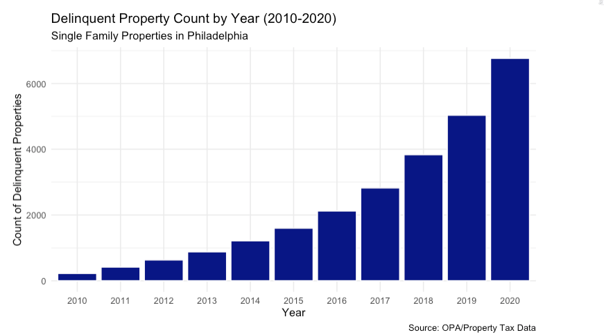

## The Problem

-   Adequately collecting property taxes has been a big issue for the City of Philadelphia\

-   Property tax delinquency directly affects city revenue\

    -   55% goes to the School District of Philadelphia
    -   45% goes to the City of Philadelphia General Fund

------------------------------------------------------------------------

## Tax Delinquency in Philadelphia

-   As of fiscal year 2024, the city was owed nearly \$197 million\
    across more than 54,000 parcels (including residential and commercial)

------------------------------------------------------------------------

## Equity Considerations:

Disproportionately Impacted Groups

-   Low-income Households\
-   Elderly\
-   Disabled\
-   Residents in gentrifying areas

------------------------------------------------------------------------

## High Repercussions

Tax delinquency debt can accumulate rapidly with added interest

**\~1.4%** - property tax rate of assessed market value

**1.5%** - monthly interest

**15%** - penalty applied for delinquency status

------------------------------------------------------------------------

## Goal

To identify which properties may need early outreach before entering tax delinquent status

-   Payment plans

-   Housing counseling

-   Location-based Information Dissemination

------------------------------------------------------------------------

## Research Question

Which properties, not delinquent in 2019, will become delinquent in 2020?

-   2020 being a significant year for the economy directly linked to the global COVID-19 pandemic.

-   Predicting delinquency for non-delinquent properties in 2019 controls for properties that were already struggling, isolating the effect of start of the pandemic in 2020

------------------------------------------------------------------------

## Significance

-   By identifying the homes which were at risk of delinquency during periods of economic instability, the model may be useful to the City of Philadelphia as a reference tool to offer an idea of the properties and, in turn, areas that may be hardest hit during future times of economic hardship.

------------------------------------------------------------------------

# Methods

------------------------------------------------------------------------

## A Logistic Regression Model

-   Outcome variable is binary: is/is not delinquent

------------------------------------------------------------------------

## Data

-   Property tax delinquency data
-   Property characteristics from OPA
-   Census demographic data
-   Spatial features

------------------------------------------------------------------------

## Data Variables

**lag_delinquent** → Whether the property was delinquent last year\
**times_delinquent_before** → Number of past delinquency years\
**log_marketvalue** → Property value (logged)\
**year_built** → Age of the property\
**log_medhhince** → Median household income (logged)\
**own_burden_rate** → Share of owners spending a high % of income on housing\
**log_over65** → % of population over 65 (logged)\
**log_pov_rate** → Poverty rate (logged)\
**in_bid** → Located in a Business Improvement District\
**log_disthca** → Distance to housing counseling services (logged)\
**log_disthotcrime** → Distance to burglary hotspots (logged)\
**in_emp** → Located in an Empowerment Zone\
**in_aff_buf** → Near affordable housing Name → Neighborhood fixed effect

------------------------------------------------------------------------

**Initial Exploration**

------------------------------------------------------------------------

## Key Insight from EDA

-   Delinquency is extremely rare
-   Most properties are not delinquent
-   **This is a rare event prediction problem**

## TO DO

Need to insert visualization/table of delinquency rate (table we made with `final_model_df %>% count(delinquent)`)

------------------------------------------------------------------------

## Why This Is Hard

-   The model learns the dominant pattern\
-   Most properties are not delinquent\
-   So the model predicts almost everything as not delinquent

------------------------------------------------------------------------

## Why Accuracy Is Misleading

-   A model can look accurate by predicting no delinquency\
-   But it misses the cases the city actually cares about

**Accuracy does not tell us if the model is useful**

------------------------------------------------------------------------

## What Happened With Our Model

-   The model predicted almost everything as not delinquent\
-   Very few properties were flagged as at risk

------------------------------------------------------------------------

## What This Means

-   The model is not broken\
-   It is responding to the structure of the data\
-   This is expected in rare event prediction

------------------------------------------------------------------------

## How We Adjusted

-   Lowered the classification threshold\
-   Added more weight to delinquent cases\
-   Focused on identifying risk instead of maximizing accuracy

------------------------------------------------------------------------

## TO DO

Need to add predicted probability histogram (this was the predicted_prob2 in test_data_clean)

------------------------------------------------------------------------

## Results

-   Accuracy changes when we adjust the model\
-   The model begins to flag more at-risk properties

**This creates a tradeoff**

------------------------------------------------------------------------

## The Tradeoff

-   More false positives\
-   Fewer missed delinquent cases

------------------------------------------------------------------------

## Policy Interpretation

-   False positive means extra outreach\
-   False negative means missing a household that needs help

**Missing risk is more costly than over-flagging**

------------------------------------------------------------------------

## TO DO

Need to add our threshold tradeoff plot (this is just the threshold_results)

------------------------------------------------------------------------

## Spatial Insight

-   Risk is not evenly distributed\
-   Some neighborhoods are harder to predict

------------------------------------------------------------------------

## TO DO

## Add delinquency map

## TO DO

Add residual map as well (block_group residuals)

------------------------------------------------------------------------

## What We Learned

-   Delinquency is difficult to predict because it is rare\
-   Standard models default to predicting no delinquency\
-   Accuracy alone is not meaningful in this setting

------------------------------------------------------------------------

## Limitations

-   Rare outcome makes prediction difficult\
-   Missing household-level financial data\
-   Model performance varies across neighborhoods

------------------------------------------------------------------------

## Recommendations

-   Use model for early outreach\
-   Prioritize support services\
-   Do not use for enforcement

------------------------------------------------------------------------

## Final Takeaway

Prediction here is not about being perfect

It is about identifying risk early enough to act

------------------------------------------------------------------------

## Thank You

Questions?
